[toc]
## flowable官方网站

https://www.flowable.com/

[GitHub - flowable/flowable-engine: A compact and highly efficient workflow and Business Process Management (BPM) platform for developers, system admins and business users.](https://github.com/flowable/flowable-engine)

官方文档

https://www.flowable.com/open-source/docs/

https://www.flowable.com/open-source/docs/userguide-5/index.html#_getting_started

## Spring Boot 集成

配置一下几个流程后，新创建的项目应可以直接运行，并在数据库中创建79张floable基础数据表+自身2张表。共81张表。


pom引入如下（因为flowable默认重写mybatis的构造器，视具体情况是否影响）
```xml
    <dependencies>
        <dependency>
            <groupId>org.springframework.boot</groupId>
            <artifactId>spring-boot-starter-web</artifactId>
        </dependency>

        <dependency>
            <groupId>org.projectlombok</groupId>
            <artifactId>lombok</artifactId>
            <optional>true</optional>
        </dependency>
        <dependency>
            <groupId>org.springframework.boot</groupId>
            <artifactId>spring-boot-starter-test</artifactId>
            <scope>test</scope>
        </dependency>

        <!--阿里json插件-->
        <!--阿里Json https://mvnrepository.com/artifact/com.alibaba/fastjson -->
        <dependency>
            <groupId>com.alibaba</groupId>
            <artifactId>fastjson</artifactId>
            <version>1.2.79</version>
        </dependency>

        <!--mysql驱动-->
        <dependency>
            <groupId>mysql</groupId>
            <artifactId>mysql-connector-java</artifactId>
            <version>8.0.25</version>
        </dependency>

        <!-- https://mvnrepository.com/artifact/com.alibaba/druid -->
        <dependency>
            <groupId>com.alibaba</groupId>
            <artifactId>druid</artifactId>
            <version>1.2.8</version>
        </dependency>

        <!--        myBatis-plus配置与代码生成器配置-->
        <dependency>
            <groupId>org.apache.velocity</groupId>
            <artifactId>velocity-engine-core</artifactId>
            <version>2.0</version>
        </dependency>
        <dependency>
            <groupId>com.baomidou</groupId>
            <artifactId>mybatis-plus-generator</artifactId>
            <version>3.4.1</version>
        </dependency>

        <dependency>
            <groupId>com.baomidou</groupId>
            <artifactId>mybatis-plus-boot-starter</artifactId>
            <version>3.0.5</version>
        </dependency>

        <!-- flowable工作流 -->
        <dependency>
            <groupId>org.flowable</groupId>
            <artifactId>flowable-spring-boot-starter</artifactId>
            <version>6.7.2</version>
        </dependency>

    </dependencies>
```

spring Boot 配置文件中应如下（使用的是MyBatis-plus）

```yaml
server:
  port: 20015

spring:
  datasource:
    #   数据源基本配置
    username: root
    password: 123456
    driver-class-name: com.mysql.cj.jdbc.Driver
    # 允许公钥 allowPublicKeyRetrieval=true
    url: jdbc:mysql://localhost:3306/fir_flowable?nullCatalogMeansCurrent=true&useUnicode=true&allowPublicKeyRetrieval=true&characterEncoding=utf-8&useSSL=false&serverTimezone =Asia/Shanghai
    type: com.alibaba.druid.pool.DruidDataSource


#mybatis-plus配置
mybatis-plus: # mybatis-plus配置
  #  #指定全局配置文件【二选一】
  #  config-location: classpath:mybatis-config.xml
  mapper-locations: classpath:mapper/*.xml # mapper映射包扫描
  type-aliases-package: com.fir.flowable.entity # entity别名

  # 开启mybatis sql日志打印
  configuration:
    log-impl: org.apache.ibatis.logging.stdout.StdOutImpl

# 引入logger日志相关配置
logging:
  config: classpath:logback-spring.xml
  
flowable:
  # 关闭异步定时任务：如果要是启动事件，则需要开启该配置
  async-executor-activate: true
```


### sql文件导入

一下两个表，为业务表，并不属于flowable官方提供的默认表


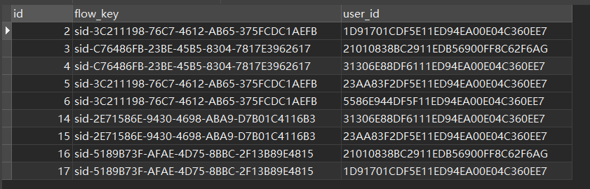

```bash
user.sql
user_flow_key.sql
```


## bpmn模型流程模型构建

### vue集成bpmn.js对流程模型构建、部署、修改设置


通过[**bpmn.js**](https://link.juejin.cn?target=https%3A%2F%2Fbpmn.io%2Ftoolkit%2Fbpmn-js%2F)。其为`Camuda`开源的一个BPM的前端JS库。其可以直接使用并定义相应的流程。建议用此种。比较方便且快捷。

前端

[bpmn-js-token-simulation - npm (npmjs.com)](https://www.npmjs.com/package/bpmn-js-token-simulation)

```
npm i bpmn-js-token-simulation
```

可实现如下编辑图（未实现）

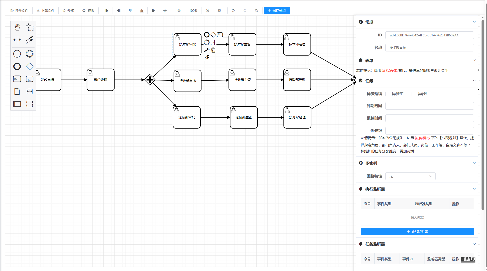


### flowable-UI，官方编辑器界面

因该ui项目，会直接修改流程数据文件，并应在实际项目中集成UI界面, 需要单独创建数据库，作为测试使用。

官方提供可直接运行的ui项目

#### spring boot项目集成

POM文件引入

```xml
        <!-- flowable工作流UI -->
        <dependency>
            <groupId>org.flowable</groupId>
            <artifactId>flowable-spring-boot-starter-ui-modeler</artifactId>
            <version>6.7.2</version>
        </dependency>
        <dependency>
            <groupId>org.flowable</groupId>
            <artifactId>flowable-spring-boot-starter-ui-admin</artifactId>
            <version>6.7.2</version>
        </dependency>
        <dependency>
            <groupId>org.flowable</groupId>
            <artifactId>flowable-spring-boot-starter-ui-idm</artifactId>
            <version>6.7.2</version>
        </dependency>
        <dependency>
            <groupId>org.flowable</groupId>
            <artifactId>flowable-spring-boot-starter-ui-task</artifactId>
            <version>6.7.2</version>
        </dependency>
        <!-- actuator -->
        <dependency>
            <groupId>org.springframework.boot</groupId>
            <artifactId>spring-boot-starter-actuator</artifactId>
        </dependency>
    </dependencies>
    <!-- flowable工作流UI -->
```


YML配置

```yaml

server:
  port: 20015
  tomcat:
    uri-encoding: UTF-8
  servlet:
    context-path: /flow-ui
spring:
  application:
    name: flow-ui-67
  servlet:
    multipart:
      enabled: true
      max-file-size: 100MB
      max-request-size: 500MB
# 引入logger日志相关配置
logging:
  config: classpath:logback-spring.xml
  file:
    path: logs
    name: ${spring.application.name}
  level:
    com.lance.flowable: debug
    org.springframework: info
    org.flowable.engine.impl.persistence.entity: debug
    org.flowable.task.service.impl.persistence.entity: debug
# flowable config
flowable:
  common:
    app:
      security:
        type: idm
      role-prefix:
      idm-admin:
        user: admin
        password: 123456
  idm:
    ldap:
      enabled: false
    app:
      admin:
        user-id: admin
        password: 123456
        first-name: Test
        last-name: Administrator
        email: test-admin@126.com
  content:
    storage:
      root-folder: data/
      create-root: true
  process:
    definition-cache-limit: 512
    async:
      executor:
        default-async-job-acquire-wait-time: PT5S
        default-timer-job-acquire-wait-time: PT5S
  cmmn:
    async:
      executor:
        default-async-job-acquire-wait-time: PT5S
        default-timer-job-acquire-wait-time: PT5S
  rest:
    app:
      authentication-mode: verify-privilege
  task:
    app:
      rest-enabled: true
  admin:
    app:
      security:
        encryption:
          credentials-i-v-spec: j8kdO2hejA9lKmm6
          credentials-secret-spec: 9FGl73ngxcOoJvmL

  form-field-validation-enabled: false
  experimental:
    debugger:
      enabled: true

management:
  endpoints:
    web:
      exposure:
        include: '*'
  endpoint:
    health:
      show-details: when_authorized
      roles: access-admin
  health:
    ldap:
      enabled: false
```


### 实际使用

#### 登录

默认地址

http://localhost:25015/flow-ui

默认用户：

账号：admin

密码：123456

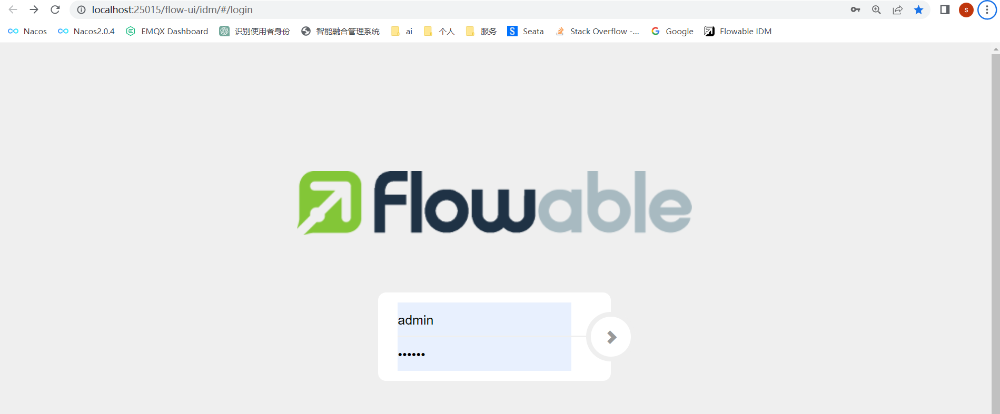

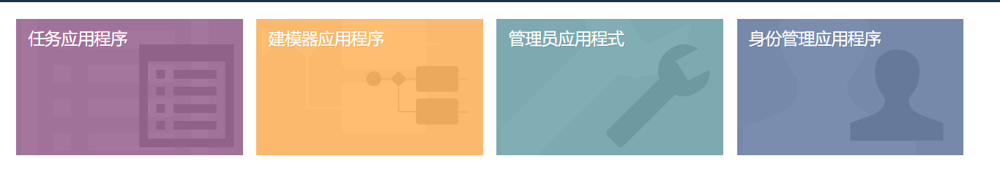

#### 创建流程

使用建模器应用程序


右上角有创建流程与导入流程。

创建流程：创建一个新的流程

模型名称：自定义，一般为流程名称，例如请假流程

模型key：**模型定义标识，唯一**，按时实际使用自命名，不能与其他流程的key重复

描述：选填

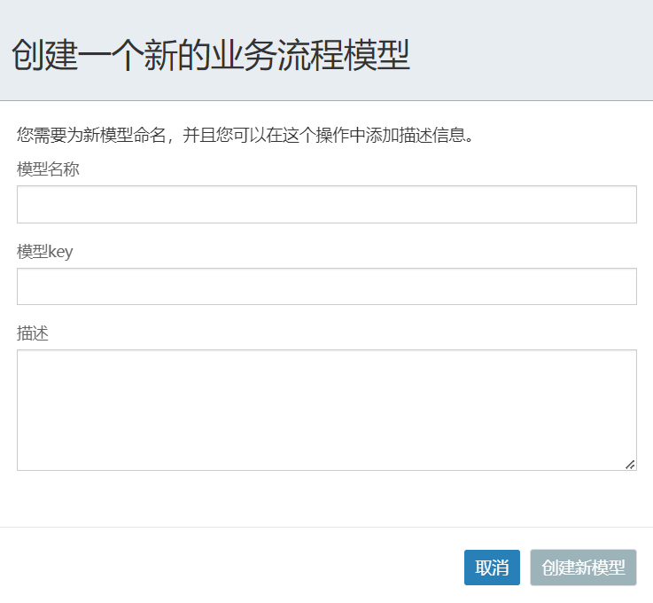

点击创建，进入设计面板界面

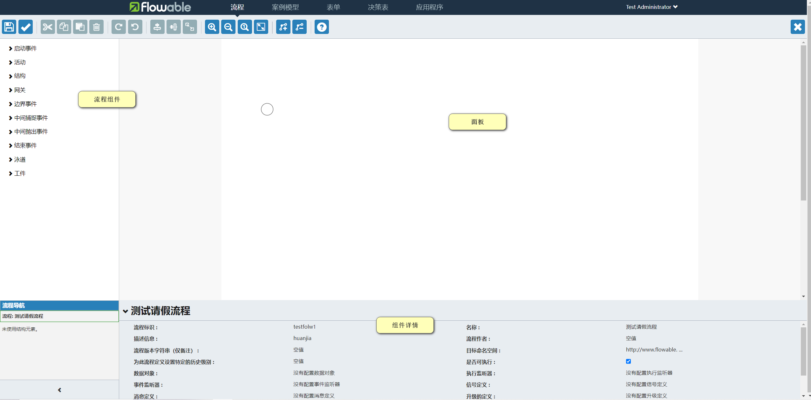


流程的组成

每个流程都有三大部分组成，**启动事件，活动事件，结束事件。**到达结束事件时，通常表示着一个流程正常结束。

##### 启动事件

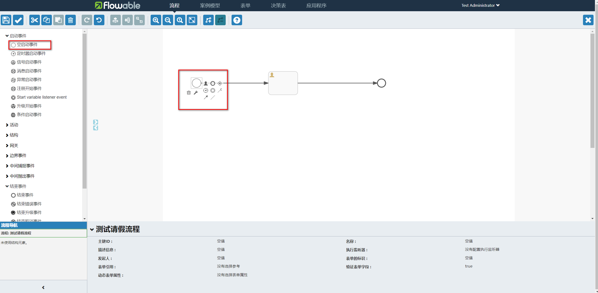

##### 活动事件

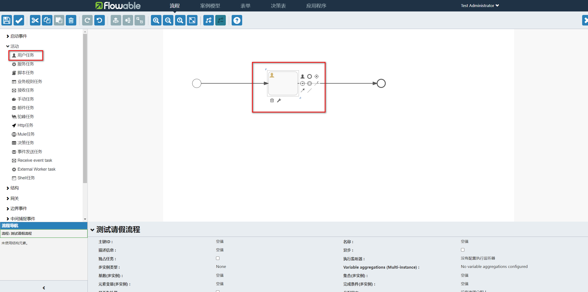

##### 结束事件

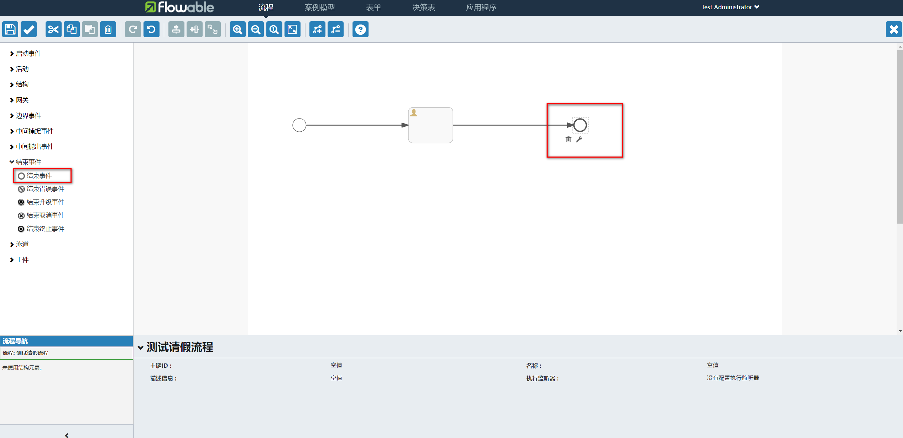

##### 连线

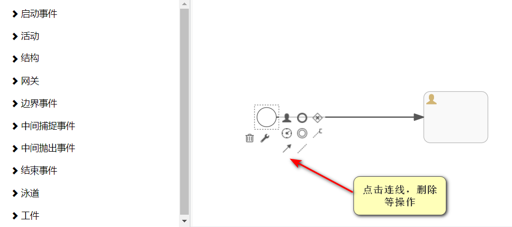


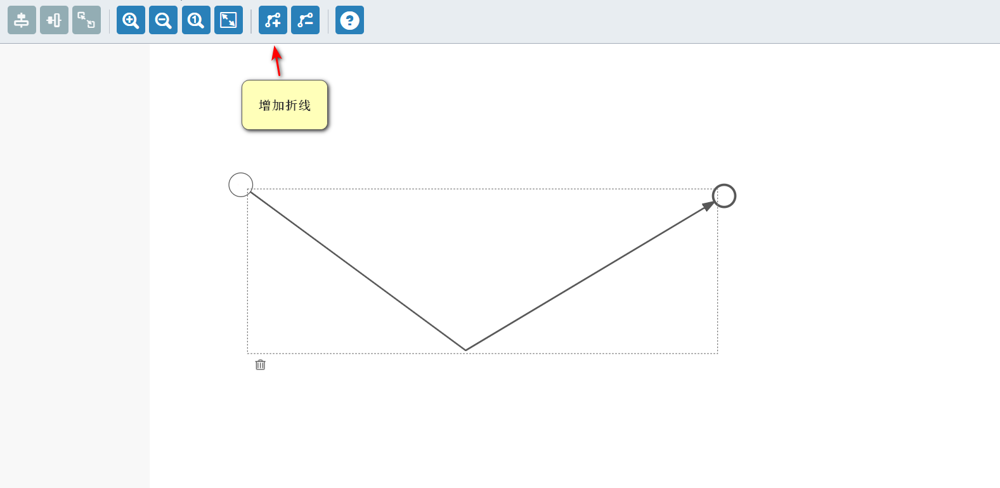

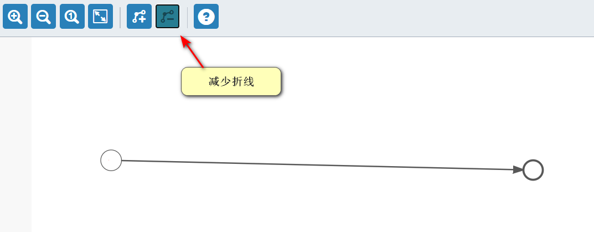

#### 任务节点设置

设置任务名称（TaskName）


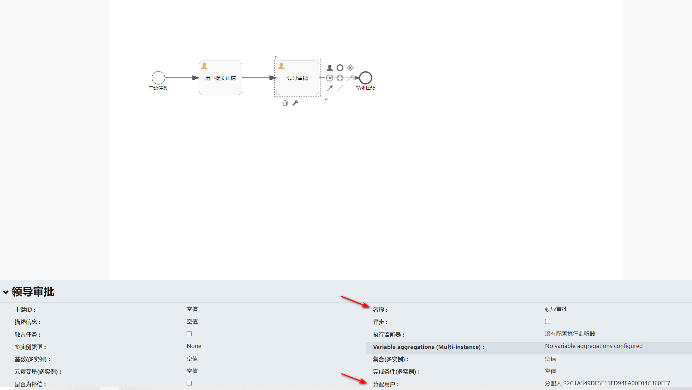

###### 设置节点审批人

选择固定值，分配输入框。输入一个用户id，保存。

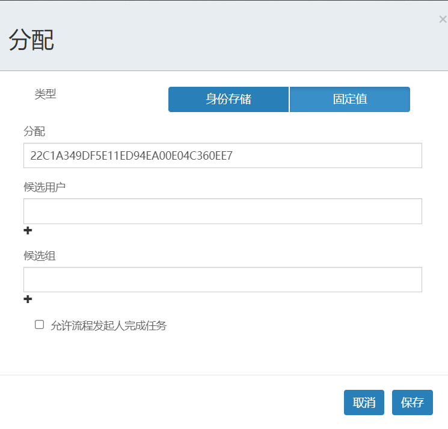

##### 编辑器绘图区大小调整

当鼠标放置于最右侧，以及最下测时，会出现调整绘制区域的按钮

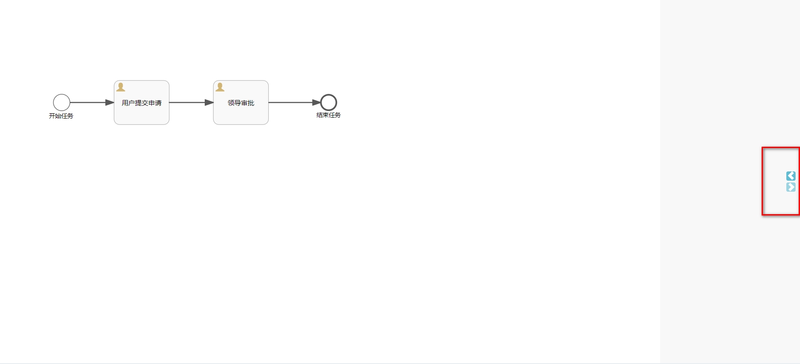

##### 即时保存防止数据丢失

在实际使用的过程中，偶尔会出现网页无法操作的情况，导致无法保存（个人经历多次）。为避免该情况发生，在实际设计的过程中，应实时保存修改的内容


##### 设计完毕

流程设置结束之后选择保存并退出，并找到刚才设计的模型单击进入。

此时通过下载按钮获取 **测试请假流程.bpmn20.xml** 流程设计文件


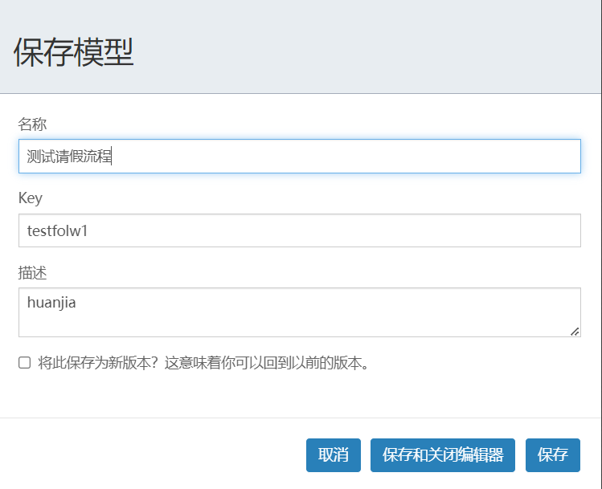

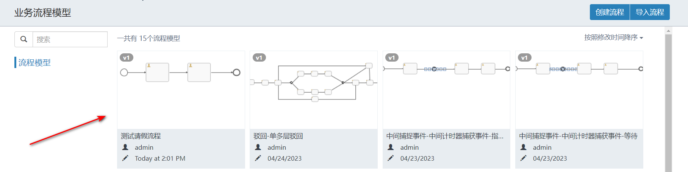


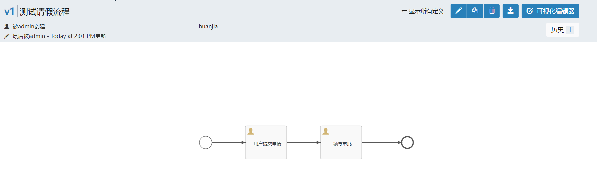

##### XXXX.bpmn20.xml 文件

###### BPMN 2.0 

[About the Business Process Model And Notation Specification Version 2.0 (omg.org)](https://www.omg.org/spec/BPMN/2.0/)

BPMN 2.0 是一种业务流程建模和标记语言，它是 Business Process Model and Notation（业务流程建模和标记）的缩写。BPMN 2.0 为业务流程建模提供了一套标准化的符号和元素，使得不同组织和个人可以使用统一的方式来描述、分析和执行业务流程。

BPMN 2.0 提供了一种图形化的表示法，用于绘制业务流程图，其中包括各种活动、事件、网关、任务、连接线等元素，以及它们之间的关系和交互。这种标记语言不仅适用于业务分析和流程设计，还可以用于实际的流程执行和自动化。

BPMN 2.0 的主要目标是提供一种通用的、可理解的、可扩展的标准，以便各个利益相关方（包括业务分析师、流程设计师、开发人员、执行引擎等）可以共同使用，并在不同的工具和系统之间进行互操作性。它已成为业界广泛采用的标准，用于描述和管理各种类型的业务流程，包括工作流、业务流程管理（BPM）和自动化流程等。


###### 测试请假流程.bpmn20.xml,内容如下

在提供的BPMN XML中，用户任务节点（User Task）用`<userTask>`元素表示，并且每个用户任务节点都有一个`id`属性和一个`name`属性。使用这些属性来唯一标识和识别节点。

根据提供的BPMN XML，以下是审批节点和下一个用户节点的相关信息：

审批节点：

- ID: `sid-061808D6-7549-4DDB-B6F3-B871BDE7DD42`
- 名称: "用户提交申请"

下一个用户节点：

- ID: `sid-1B0EB0A2-D6D9-4BE6-8CCF-7DEA714C6D36`
- 名称: "领导审批"

此时从该文件获取到的关键参数信息为

**processDefinitionKey(流程定义Key)**: testfolw1

**processDefinitionName(流程定义名称)**：测试请假流程

**TaskKey(流程任务键)**:

​	开始任务：startEvent1

​	用户提交申请：sid-061808D6-7549-4DDB-B6F3-B871BDE7DD42

​	领导审批：sid-1B0EB0A2-D6D9-4BE6-8CCF-7DEA714C6D36

​	领导结束任务：sid-D28AF79F-9AB5-4C27-B56A-F3D0AD7B804C

T**askName(流程任务名称)**:

​	开始任务

​	用户提交申请

​	领导审批

​	领导结束任务

**assignee(流程节点审批人)**：flowable:assignee="22C1A349DF5E11ED94EA00E04C360EE7"


在 BPMN 2.0 中，"assignee" 是一个常用的属性，用于指定任务的执行者或负责人。它可以被应用在用户任务（User Task）元素上，用于确定执行该任务的具体人员或组织。

在 Flowable 中，"assignee" 属性是用于指定用户任务执行者的一个字段。可以在 BPMN 文件中的用户任务元素上设置该字段，或者通过 Flowable 的 API 在运行时动态设置。当用户任务被激活时，指定的执行者将被分配给该任务，并负责完成任务的执行。


```xml
<?xml version="1.0" encoding="UTF-8"?>
<definitions xmlns="http://www.omg.org/spec/BPMN/20100524/MODEL" xmlns:xsi="http://www.w3.org/2001/XMLSchema-instance" xmlns:xsd="http://www.w3.org/2001/XMLSchema" xmlns:flowable="http://flowable.org/bpmn" xmlns:bpmndi="http://www.omg.org/spec/BPMN/20100524/DI" xmlns:omgdc="http://www.omg.org/spec/DD/20100524/DC" xmlns:omgdi="http://www.omg.org/spec/DD/20100524/DI" typeLanguage="http://www.w3.org/2001/XMLSchema" expressionLanguage="http://www.w3.org/1999/XPath" targetNamespace="http://www.flowable.org/processdef" exporter="Flowable Open Source Modeler" exporterVersion="6.7.2">
  <process id="testfolw1" name="测试请假流程" isExecutable="true">
    <documentation>huanjia</documentation>
    <startEvent id="startEvent1" name="开始任务" flowable:formFieldValidation="true"></startEvent>
    <userTask id="sid-061808D6-7549-4DDB-B6F3-B871BDE7DD42" name="用户提交申请" flowable:formFieldValidation="true"></userTask>
    <sequenceFlow id="sid-19E146A1-8D47-4097-BD62-A53BEBBFDD6B" sourceRef="startEvent1" targetRef="sid-061808D6-7549-4DDB-B6F3-B871BDE7DD42"></sequenceFlow>
    <endEvent id="sid-D28AF79F-9AB5-4C27-B56A-F3D0AD7B804C" name="结束任务"></endEvent>
    <userTask id="sid-1B0EB0A2-D6D9-4BE6-8CCF-7DEA714C6D36" name="领导审批" flowable:assignee="22C1A349DF5E11ED94EA00E04C360EE7" flowable:formFieldValidation="true">
      <extensionElements>
        <modeler:initiator-can-complete xmlns:modeler="http://flowable.org/modeler"><![CDATA[false]]></modeler:initiator-can-complete>
      </extensionElements>
    </userTask>
    <sequenceFlow id="sid-7E9FF3D8-B1EB-4848-B1FF-5933D7C254E9" sourceRef="sid-061808D6-7549-4DDB-B6F3-B871BDE7DD42" targetRef="sid-1B0EB0A2-D6D9-4BE6-8CCF-7DEA714C6D36"></sequenceFlow>
    <sequenceFlow id="sid-2BFBA7A3-C86B-4EA1-97D8-C759B161B89E" sourceRef="sid-1B0EB0A2-D6D9-4BE6-8CCF-7DEA714C6D36" targetRef="sid-D28AF79F-9AB5-4C27-B56A-F3D0AD7B804C"></sequenceFlow>
  </process>
  <bpmndi:BPMNDiagram id="BPMNDiagram_testfolw1">
    <bpmndi:BPMNPlane bpmnElement="testfolw1" id="BPMNPlane_testfolw1">
      <bpmndi:BPMNShape bpmnElement="startEvent1" id="BPMNShape_startEvent1">
        <omgdc:Bounds height="30.0" width="29.999999999999986" x="99.99999701976783" y="170.99998994171656"></omgdc:Bounds>
      </bpmndi:BPMNShape>
      <bpmndi:BPMNShape bpmnElement="sid-061808D6-7549-4DDB-B6F3-B871BDE7DD42" id="BPMNShape_sid-061808D6-7549-4DDB-B6F3-B871BDE7DD42">
        <omgdc:Bounds height="80.0" width="100.0" x="209.9999968707562" y="145.9999877661472"></omgdc:Bounds>
      </bpmndi:BPMNShape>
      <bpmndi:BPMNShape bpmnElement="sid-D28AF79F-9AB5-4C27-B56A-F3D0AD7B804C" id="BPMNShape_sid-D28AF79F-9AB5-4C27-B56A-F3D0AD7B804C">
        <omgdc:Bounds height="28.0" width="28.0" x="584.9999912828208" y="171.99998737871704"></omgdc:Bounds>
      </bpmndi:BPMNShape>
      <bpmndi:BPMNShape bpmnElement="sid-1B0EB0A2-D6D9-4BE6-8CCF-7DEA714C6D36" id="BPMNShape_sid-1B0EB0A2-D6D9-4BE6-8CCF-7DEA714C6D36">
        <omgdc:Bounds height="80.0" width="100.0" x="389.99999418854725" y="145.9999899268154"></omgdc:Bounds>
      </bpmndi:BPMNShape>
      <bpmndi:BPMNEdge bpmnElement="sid-7E9FF3D8-B1EB-4848-B1FF-5933D7C254E9" id="BPMNEdge_sid-7E9FF3D8-B1EB-4848-B1FF-5933D7C254E9" flowable:sourceDockerX="50.0" flowable:sourceDockerY="40.0" flowable:targetDockerX="50.0" flowable:targetDockerY="40.0">
        <omgdi:waypoint x="309.94999675389516" y="185.99998836573263"></omgdi:waypoint>
        <omgdi:waypoint x="389.99999418854594" y="185.9999893266298"></omgdi:waypoint>
      </bpmndi:BPMNEdge>
      <bpmndi:BPMNEdge bpmnElement="sid-2BFBA7A3-C86B-4EA1-97D8-C759B161B89E" id="BPMNEdge_sid-2BFBA7A3-C86B-4EA1-97D8-C759B161B89E" flowable:sourceDockerX="50.0" flowable:sourceDockerY="40.0" flowable:targetDockerX="14.0" flowable:targetDockerY="14.0">
        <omgdi:waypoint x="489.94999285241295" y="185.9999891255266"></omgdi:waypoint>
        <omgdi:waypoint x="584.9999912828208" y="185.9999876022766"></omgdi:waypoint>
      </bpmndi:BPMNEdge>
      <bpmndi:BPMNEdge bpmnElement="sid-19E146A1-8D47-4097-BD62-A53BEBBFDD6B" id="BPMNEdge_sid-19E146A1-8D47-4097-BD62-A53BEBBFDD6B" flowable:sourceDockerX="14.999999999999993" flowable:sourceDockerY="15.0" flowable:targetDockerX="50.0" flowable:targetDockerY="40.0">
        <omgdi:waypoint x="129.94999615061147" y="185.99998971665767"></omgdi:waypoint>
        <omgdi:waypoint x="209.99999483189427" y="185.99998851559334"></omgdi:waypoint>
      </bpmndi:BPMNEdge>
    </bpmndi:BPMNPlane>
  </bpmndi:BPMNDiagram>
</definitions>
```


#### 使用流程

通过[创建流程](#创建流程)后，得到一个 **测试请假流程.bpmn20 .xml** 一下将结合代码说明该文件如何使用。

##### 导入流程文件至业务系统

```http
/mt/flow/definition/import
```

```java
	private static final String BPMN_FILE_SUFFIX = ".bpmn";

	/**
     * 导入流程文件
     *
     * @param name 流程名称
     * @param category 流程分类
     * @param in .bpmn20.xml 文件流
     */
    @Override
    public void importFile(String name, String category, InputStream in) {
        Deployment deploy = repositoryService.createDeployment()
                .addInputStream(name + BPMN_FILE_SUFFIX, in)
                .name(name)
                .category(category)
                .deploy();
        ProcessDefinition definition = repositoryService.createProcessDefinitionQuery()
                .deploymentId(deploy.getId())
                .singleResult();
        repositoryService.setProcessDefinitionCategory(definition.getId(), category);
    }
```

代码的主要逻辑如下：

1. 方法接收三个参数：`name` 表示流程名称，`category` 表示流程分类，`in` 是一个 `.bpmn20.xml` 文件的输入流。
2. 首先，通过 `repositoryService.createDeployment()` 创建一个流程部署对象 `DeploymentBuilder`。
3. 使用 `.addInputStream()` 方法将输入流 `in` 添加到流程部署中，以指定的流程名称为文件名并添加后缀 `.bpmn`。
4. 使用 `.name()` 方法设置流程部署的名称为 `name`。
5. 使用 `.category()` 方法设置流程部署的分类为 `category`。
6. 调用 `.deploy()` 方法执行流程部署，将流程文件导入 Flowable 引擎中。
7. 接着，通过 `repositoryService.createProcessDefinitionQuery()` 创建一个流程定义查询对象。
8. 使用 `.deploymentId()` 方法设置查询条件为刚刚部署的流程部署的 ID，即 `deploy.getId()`。
9. 使用 `.singleResult()` 方法获取查询结果的单个流程定义对象。
10. 调用 `repositoryService.setProcessDefinitionCategory()` 方法，将流程定义的分类设置为 `category`，以便对流程进行分类管理。

以上代码片段实现了将流程文件导入并进行流程部署的功能，并设置了流程的名称和分类。这样，在后续的流程执行中，可以根据流程名称和分类进行流程定义的管理和查询。

##### 查询流程列表

```http
/mt/flow/definition/list
```

该接口将有一下的返回值信息，此时得到关键参数为

**deploymentId 流程部署id**:  8435059a-ee38-11ed-b972-f44637b1357e

**processDefinitionId 流程定义Id**:  testfolw1:1:846eda4d-ee38-11ed-b972-f44637b1357e

**processDefinitionKey 流程定义Key**:  testfolw1

```json
{
  "msg": "请求成功",
  "code": 200,
  "data": {
    "records": [
      {
        "id": "testfolw1:1:846eda4d-ee38-11ed-b972-f44637b1357e",
        "name": "测试请假流程",
        "flowKey": "testfolw1",
        "category": "测试类别",
        "formName": null,
        "formId": null,
        "version": 1,
        "deploymentId": "8435059a-ee38-11ed-b972-f44637b1357e",
        "suspensionState": 1,
        "deploymentTime": "2023-05-09 07:10:02"
      }
    ]
  }
}
```

在实际界面应用为

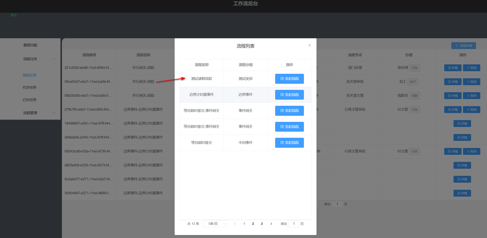

```java
    /**
     * 流程定义列表
     *
     * @param pageNum  当前页码
     * @param pageSize 每页条数
     * @return 流程定义分页列表数据
     */
    @Override
    public Page<FlowProcDefDto> list(String name, Integer pageNum, Integer pageSize) {

        Page<FlowProcDefDto> page = new Page<>();
        PageHelper.startPage(pageNum, pageSize);
        final List<FlowProcDefDto> dataList = flowDeployMapper.selectDeployList(name);
        PageInfo<FlowProcDefDto> pageInfo = new PageInfo<>(dataList);
        page.setTotal(pageInfo.getTotal());
        page.setRecords(dataList);
        return page;
    }
```

```xml
    <select id="selectDeployList" resultType="com.fir.flow.domain.vo.FlowProcDefDto">

        SELECT
            rp.id_ as id,
            rd.id_ as deploymentId,
            rd.name_ as name,
            rd.category_ as category,
            rp.key_ as flowKey,
            rp.version_ as version,
            rp.suspension_state_ as suspensionState,
            rd.deploy_time_  as deploymentTime
        FROM
            ACT_RE_PROCDEF rp
                LEFT JOIN ACT_RE_DEPLOYMENT rd ON rp.deployment_id_ = rd.id_
        <where>
            <if test="name != null and name != ''">
               and rd.name_ like concat('%', #{name}, '%')
            </if>
        </where>
        order by rd.deploy_time_ desc
    </select>
```

###### 获取流程部署xml文件

```http
/mt/flow/definition/read/xml
```


```java
    /**
     * 读取xml
     *
     * @param deployId 流程定义id
     * @return xml文件字符串信息
     */
    @Override
    public AjaxResult readXml(String deployId) throws IOException {
        ProcessDefinition definition = repositoryService.createProcessDefinitionQuery().deploymentId(deployId).singleResult();
        InputStream inputStream = repositoryService.getResourceAsStream(definition.getDeploymentId(), definition.getResourceName());
        String result = IOUtils.toString(inputStream, StandardCharsets.UTF_8);
        return AjaxResult.success(AjaxResultCode.SUCCESS, result);
    }
```

返回值：

```json
{
  "msg": "请求成功",
  "code": 200,
  "data": "<?xml version=\"1.0\" encoding=\"UTF-8\"?>\n<definitions xmlns=\"http://www.omg.org/spec/BPMN/20100524/MODEL\" xmlns:xsi=\"http://www.w3.org/2001/XMLSchema-instance\" xmlns:xsd=\"http://www.w3.org/2001/XMLSchema\" xmlns:flowable=\"http://flowable.org/bpmn\" xmlns:bpmndi=\"http://www.omg.org/spec/BPMN/20100524/DI\" xmlns:omgdc=\"http://www.omg.org/spec/DD/20100524/DC\" xmlns:omgdi=\"http://www.omg.org/spec/DD/20100524/DI\" typeLanguage=\"http://www.w3.org/2001/XMLSchema\" expressionLanguage=\"http://www.w3.org/1999/XPath\" targetNamespace=\"http://www.flowable.org/processdef\" exporter=\"Flowable Open Source Modeler\" exporterVersion=\"6.7.2\">\n  <process id=\"testfolw1\" name=\"测试请假流程\" isExecutable=\"true\">\n    <documentation>huanjia</documentation>\n    <startEvent id=\"startEvent1\" name=\"开始任务\" flowable:formFieldValidation=\"true\"></startEvent>\n    <userTask id=\"sid-061808D6-7549-4DDB-B6F3-B871BDE7DD42\" name=\"用户提交申请\" flowable:formFieldValidation=\"true\"></userTask>\n    <sequenceFlow id=\"sid-19E146A1-8D47-4097-BD62-A53BEBBFDD6B\" sourceRef=\"startEvent1\" targetRef=\"sid-061808D6-7549-4DDB-B6F3-B871BDE7DD42\"></sequenceFlow>\n    <endEvent id=\"sid-D28AF79F-9AB5-4C27-B56A-F3D0AD7B804C\" name=\"结束任务\"></endEvent>\n    <userTask id=\"sid-1B0EB0A2-D6D9-4BE6-8CCF-7DEA714C6D36\" name=\"领导审批\" flowable:assignee=\"22C1A349DF5E11ED94EA00E04C360EE7\" flowable:formFieldValidation=\"true\">\n      <extensionElements>\n        <modeler:initiator-can-complete xmlns:modeler=\"http://flowable.org/modeler\"><![CDATA[false]]></modeler:initiator-can-complete>\n      </extensionElements>\n    </userTask>\n    <sequenceFlow id=\"sid-7E9FF3D8-B1EB-4848-B1FF-5933D7C254E9\" sourceRef=\"sid-061808D6-7549-4DDB-B6F3-B871BDE7DD42\" targetRef=\"sid-1B0EB0A2-D6D9-4BE6-8CCF-7DEA714C6D36\"></sequenceFlow>\n    <sequenceFlow id=\"sid-2BFBA7A3-C86B-4EA1-97D8-C759B161B89E\" sourceRef=\"sid-1B0EB0A2-D6D9-4BE6-8CCF-7DEA714C6D36\" targetRef=\"sid-D28AF79F-9AB5-4C27-B56A-F3D0AD7B804C\"></sequenceFlow>\n  </process>\n  <bpmndi:BPMNDiagram id=\"BPMNDiagram_testfolw1\">\n    <bpmndi:BPMNPlane bpmnElement=\"testfolw1\" id=\"BPMNPlane_testfolw1\">\n      <bpmndi:BPMNShape bpmnElement=\"startEvent1\" id=\"BPMNShape_startEvent1\">\n        <omgdc:Bounds height=\"30.0\" width=\"29.999999999999986\" x=\"99.99999701976783\" y=\"170.99998994171656\"></omgdc:Bounds>\n      </bpmndi:BPMNShape>\n      <bpmndi:BPMNShape bpmnElement=\"sid-061808D6-7549-4DDB-B6F3-B871BDE7DD42\" id=\"BPMNShape_sid-061808D6-7549-4DDB-B6F3-B871BDE7DD42\">\n        <omgdc:Bounds height=\"80.0\" width=\"100.0\" x=\"209.9999968707562\" y=\"145.9999877661472\"></omgdc:Bounds>\n      </bpmndi:BPMNShape>\n      <bpmndi:BPMNShape bpmnElement=\"sid-D28AF79F-9AB5-4C27-B56A-F3D0AD7B804C\" id=\"BPMNShape_sid-D28AF79F-9AB5-4C27-B56A-F3D0AD7B804C\">\n        <omgdc:Bounds height=\"28.0\" width=\"28.0\" x=\"584.9999912828208\" y=\"171.99998737871704\"></omgdc:Bounds>\n      </bpmndi:BPMNShape>\n      <bpmndi:BPMNShape bpmnElement=\"sid-1B0EB0A2-D6D9-4BE6-8CCF-7DEA714C6D36\" id=\"BPMNShape_sid-1B0EB0A2-D6D9-4BE6-8CCF-7DEA714C6D36\">\n        <omgdc:Bounds height=\"80.0\" width=\"100.0\" x=\"389.99999418854725\" y=\"145.9999899268154\"></omgdc:Bounds>\n      </bpmndi:BPMNShape>\n      <bpmndi:BPMNEdge bpmnElement=\"sid-7E9FF3D8-B1EB-4848-B1FF-5933D7C254E9\" id=\"BPMNEdge_sid-7E9FF3D8-B1EB-4848-B1FF-5933D7C254E9\" flowable:sourceDockerX=\"50.0\" flowable:sourceDockerY=\"40.0\" flowable:targetDockerX=\"50.0\" flowable:targetDockerY=\"40.0\">\n        <omgdi:waypoint x=\"309.94999675389516\" y=\"185.99998836573263\"></omgdi:waypoint>\n        <omgdi:waypoint x=\"389.99999418854594\" y=\"185.9999893266298\"></omgdi:waypoint>\n      </bpmndi:BPMNEdge>\n      <bpmndi:BPMNEdge bpmnElement=\"sid-2BFBA7A3-C86B-4EA1-97D8-C759B161B89E\" id=\"BPMNEdge_sid-2BFBA7A3-C86B-4EA1-97D8-C759B161B89E\" flowable:sourceDockerX=\"50.0\" flowable:sourceDockerY=\"40.0\" flowable:targetDockerX=\"14.0\" flowable:targetDockerY=\"14.0\">\n        <omgdi:waypoint x=\"489.94999285241295\" y=\"185.9999891255266\"></omgdi:waypoint>\n        <omgdi:waypoint x=\"584.9999912828208\" y=\"185.9999876022766\"></omgdi:waypoint>\n      </bpmndi:BPMNEdge>\n      <bpmndi:BPMNEdge bpmnElement=\"sid-19E146A1-8D47-4097-BD62-A53BEBBFDD6B\" id=\"BPMNEdge_sid-19E146A1-8D47-4097-BD62-A53BEBBFDD6B\" flowable:sourceDockerX=\"14.999999999999993\" flowable:sourceDockerY=\"15.0\" flowable:targetDockerX=\"50.0\" flowable:targetDockerY=\"40.0\">\n        <omgdi:waypoint x=\"129.94999615061147\" y=\"185.99998971665767\"></omgdi:waypoint>\n        <omgdi:waypoint x=\"209.99999483189427\" y=\"185.99998851559334\"></omgdi:waypoint>\n      </bpmndi:BPMNEdge>\n    </bpmndi:BPMNPlane>\n  </bpmndi:BPMNDiagram>\n</definitions>"
}
```

使用组件显示该流程图 变量为bpmnXML

```vue
            <!--  流程图显示-->
            <el-card class="box-card-bpmnXML" :body-style="{ height: '100%', margin: '0 0 0 6%' }" >

                <template v-slot:header>
                    <i class="el-icon-picture"></i>
                    <span>流程图</span>
                </template>

                <el-col class="box-body" :span="16" >
                    <my-process-viewer key="designer"  v-model="bpmnXML" v-bind="bpmnControlForm"
                                       :activityData="activityList" :taskData="tasks"/>
                </el-col>
            </el-card>
```


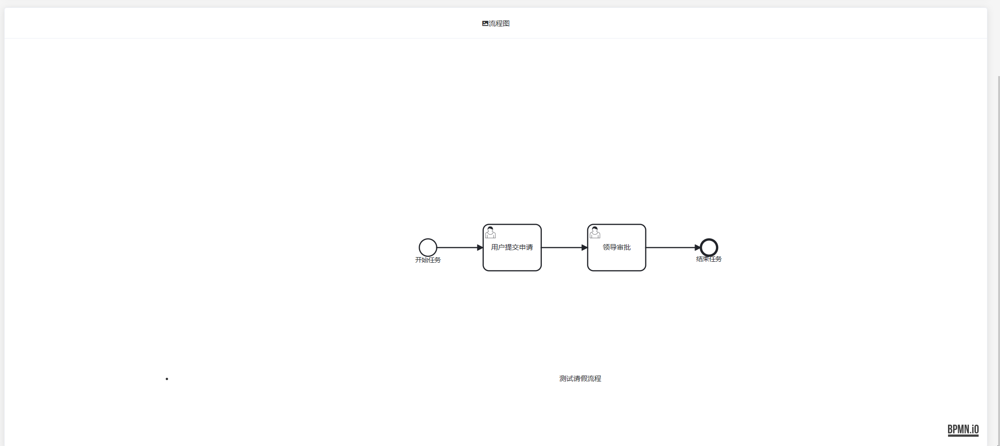

###### 发起一个流程

前端提供表单


```vue
            <el-card class="box-card">
                <template v-slot:header>
                    <i class="el-icon-document"></i>
                    <span>基础信息</span>
                    <el-button style="float: right;" type="primary" @click="goBack">返回</el-button>
                </template>

                <el-form width="55%">
                    <fromInfo ref="fromFunction" :disabledKey=false></fromInfo>
                </el-form>
            </el-card>
```

表单实际内容为

```vue
<template>
    <div class="from">
        <el-form>
            <el-row>
                <el-col :span="18">
                    <el-form-item label="申请人" label-width="120px" prop="deviceId">
                        <el-input :disabled="!disabledKey" v-model="fromData.username" placeholder="请输入申请人"
                            style="width: 125.5%;" />
                    </el-form-item>
                </el-col>
            </el-row>
            <el-row>
                <el-col :span="22">
                    <el-form-item label="申请原因" label-width="120px" prop="reason">
                        <el-input type="textarea" :autosize="{minRows:4,maxRows:8}" :disabled="!disabledKey"
                            v-model="fromData.reason" placeholder="请输入申请原因" style="width:100%">
                        </el-input>
                    </el-form-item>
                </el-col>
            </el-row>

            <el-row>
                <el-col :span="22">
                    <el-form-item label="时间" label-width="120px" prop="reason">
                        <el-date-picker v-model="fromData.date" type="daterange" range-separator="至" :disabled="!disabledKey"
                            value-format="yyyy-MM-dd" start-placeholder="开始时间" end-placeholder="结束时间">
                        </el-date-picker>
                    </el-form-item>
                </el-col>
            </el-row>
        </el-form>
    </div>
</template>

<script>
    export default {
        name: "fromInfo",

        props: ["disabledKey"],


        data() {
            return {
                // 流程申请信息对象
                fromData: {
                    username: "",
                    reason: "",
                    data: "",
                },
            }
        },

        methods: {

            // 赋值当前表单信息
            setFormValue(data) {
                this.fromData = data;
            },

            // 返回当前表单信息
            getFormValue() {
                return this.fromData;
            },

            // 清空表单信息
            cleanFormValue() {
                this.fromData = {};
            }

        },
    }
</script>

<style scoped>
    .from {
        margin: 0 auto;
        width: 80%;
        height: 40%;
    }
</style>
```


```http
/mt/flow/definition/start
```


```java
    /**
     * 根据流程定义ID启动流程实例
     *
     * @param procDefId 流程定义id
     * @param variables 申请内容对象
     * @throws Exception 流程启动失败
     */
    @Override
    public void startProcessInstanceById(String procDefId, Map<String, Object> variables) throws Exception{
        String name = UserInfoTools.userName();
        String userId = UserInfoTools.userId();

        // 如有流程中设置 ${day<5} 等判断条件,则 variables 中需要配置该参数不然会报错
            ProcessDefinition processDefinition = repositoryService.createProcessDefinitionQuery().processDefinitionId(procDefId)
                    .latestVersion().singleResult();
            if (Objects.nonNull(processDefinition) && processDefinition.isSuspended()) {
               throw new DescriptionException("流程已被挂起,请先激活流程");
            }

            // 设置流程发起人Id到流程中
            identityService.setAuthenticatedUserId(userId);
            variables.put(ProcessConstants.PROCESS_INITIATOR, "");
            ProcessInstance processInstance = runtimeService.startProcessInstanceById(procDefId, variables);
            // 给第一步申请人节点设置任务执行人和意见 第一个节点不设置为申请人节点有点问题？
            Task task = taskService.createTaskQuery().processInstanceId(processInstance.getProcessInstanceId()).singleResult();
            if (Objects.nonNull(task)) {
                taskService.addComment(task.getId(), processInstance.getProcessInstanceId(), FlowComment.NORMAL.getType(), name + "发起流程申请");
                taskService.setAssignee(task.getId(), userId);
                taskService.complete(task.getId(), variables);
            }
    }
}
```

###### 查看流程

```http
// 显示流程图
mt/flow/definition/read/xml
```


####### 流程活动实例

```http
/mt/flow/view/list
```


```json
{
  "msg": "请求成功",
  "code": 200,
  "data": [
    {
      "key": "startEvent1",
      "type": "startEvent",
      "startTime": 1683689083128,
      "endTime": 1683689083130,
      "taskId": null
    },
    {
      "key": "sid-19E146A1-8D47-4097-BD62-A53BEBBFDD6B",
      "type": "sequenceFlow",
      "startTime": 1683689083130,
      "endTime": 1683689083130,
      "taskId": null
    },
    {
      "key": "sid-061808D6-7549-4DDB-B6F3-B871BDE7DD42",
      "type": "userTask",
      "startTime": 1683689083130,
      "endTime": 1683689083181,
      "taskId": "34a06601-eee2-11ed-9ef2-f44637b1357e"
    },
    {
      "key": "sid-7E9FF3D8-B1EB-4848-B1FF-5933D7C254E9",
      "type": "sequenceFlow",
      "startTime": 1683689083181,
      "endTime": 1683689083181,
      "taskId": null
    },
    {
      "key": "sid-1B0EB0A2-D6D9-4BE6-8CCF-7DEA714C6D36",
      "type": "userTask",
      "startTime": 1683689083182,
      "endTime": null,
      "taskId": "34a85549-eee2-11ed-9ef2-f44637b1357e"
    }
  ]
}
```


```java
    /**
     * 获得指定流程实例的活动实例列表
     *
     * @param processInstanceId 流程实例的编号
     * @return 活动实例列表
     */
    @Override
    public List<BpmActivityRespVO> getActivityListByProcessInstanceId(String processInstanceId) {
        List<HistoricActivityInstance> activityList = historyService.createHistoricActivityInstanceQuery()
                .processInstanceId(processInstanceId).list();

        List<BpmActivityRespVO> bpmActivityRespVOList = new ArrayList<>(activityList.size());
        for (HistoricActivityInstance historicActivityInstance : activityList) {

            BpmActivityRespVO bpmActivityRespVO = new BpmActivityRespVO();

            bpmActivityRespVO.setKey(historicActivityInstance.getActivityId());
            bpmActivityRespVO.setType(historicActivityInstance.getActivityType());
            bpmActivityRespVO.setStartTime(historicActivityInstance.getStartTime());
            bpmActivityRespVO.setEndTime(historicActivityInstance.getEndTime());
            bpmActivityRespVO.setTaskId(historicActivityInstance.getTaskId());
            bpmActivityRespVOList.add(bpmActivityRespVO);
        }
        return bpmActivityRespVOList;
    }
```


```java
import io.swagger.annotations.ApiModel;
import io.swagger.annotations.ApiModelProperty;
import lombok.Data;
import java.util.Date;


@ApiModel("管理后台 - 流程活动的 Response VO")
@Data
public class BpmActivityRespVO {

    @ApiModelProperty(value = "流程活动的标识", required = true, example = "1024")
    private String key;
    @ApiModelProperty(value = "流程活动的类型", required = true, example = "StartEvent")
    private String type;

    @ApiModelProperty(value = "流程活动的开始时间", required = true)
    private Date startTime;
    @ApiModelProperty(value = "流程活动的结束时间", required = true)
    private Date endTime;

    @ApiModelProperty(value = "关联的流程任务的编号", example = "2048", notes = "关联的流程任务，只有 UserTask 等类型才有")
    private String taskId;

}
```


####### 任务流转记录

```http
/mt/flow/view/list/process/instance/id
```


```json
{
  "msg": "请求成功",
  "code": 200,
  "data": [
    {
      "id": "34a06601-eee2-11ed-9ef2-f44637b1357e",
      "name": "业务",
      "claimTime": 1683689083000,
      "createTime": 1683689083000,
      "suspensionState": null,
      "processInstance": {
        "id": "349fc9b4-eee2-11ed-9ef2-f44637b1357e",
        "name": "测试请假流程",
        "startUserId": "21010838BC2911EDB56900FF8C62F6AG",
        "startUserNickname": "杉",
        "processDefinitionId": "349fc9b4-eee2-11ed-9ef2-f44637b1357e"
      },
      "endTime": null,
      "durationInMillis": null,
      "result": 2,
      "reason": "杉发起流程申请",
      "definitionKey": "sid-19E146A1-8D47-4097-BD62-A53BEBBFDD6B",
      "taskDefinitionKey": "sid-061808D6-7549-4DDB-B6F3-B871BDE7DD42",
      "assigneeUser": {
        "id": "21010838BC2911EDB56900FF8C62F6AG",
        "nickname": "杉",
        "deptId": null,
        "deptName": "业务"
      }
    },
    {
      "id": "34a85549-eee2-11ed-9ef2-f44637b1357e",
      "name": "业务",
      "claimTime": null,
      "createTime": 1683689083000,
      "suspensionState": null,
      "processInstance": {
        "id": "349fc9b4-eee2-11ed-9ef2-f44637b1357e",
        "name": "测试请假流程",
        "startUserId": "21010838BC2911EDB56900FF8C62F6AG",
        "startUserNickname": "杉",
        "processDefinitionId": "349fc9b4-eee2-11ed-9ef2-f44637b1357e"
      },
      "endTime": null,
      "durationInMillis": null,
      "result": 1,
      "reason": "",
      "definitionKey": "startEvent1",
      "taskDefinitionKey": "sid-1B0EB0A2-D6D9-4BE6-8CCF-7DEA714C6D36",
      "assigneeUser": {
        "id": "22C1A349DF5E11ED94EA00E04C360EE7",
        "nickname": "冀经理",
        "deptId": null,
        "deptName": "业务"
      }
    }
  ]
}
```


##### 查看用户待办任务

```http
/mt/flow/task/todo/list
```


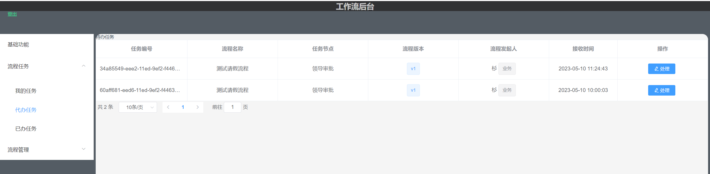

###### 处理代办任务

待办任务能查询到的数据如下

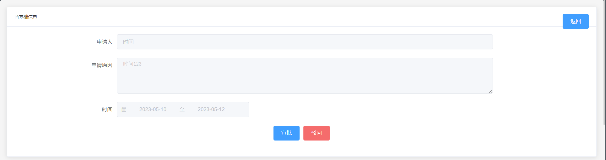

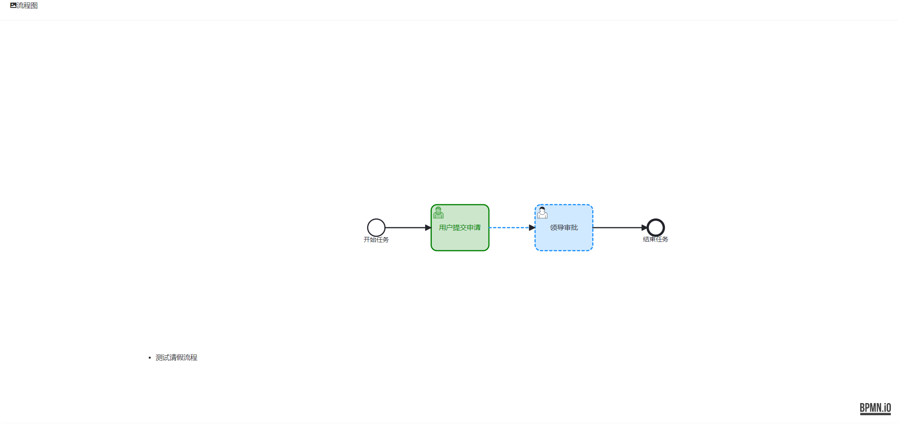

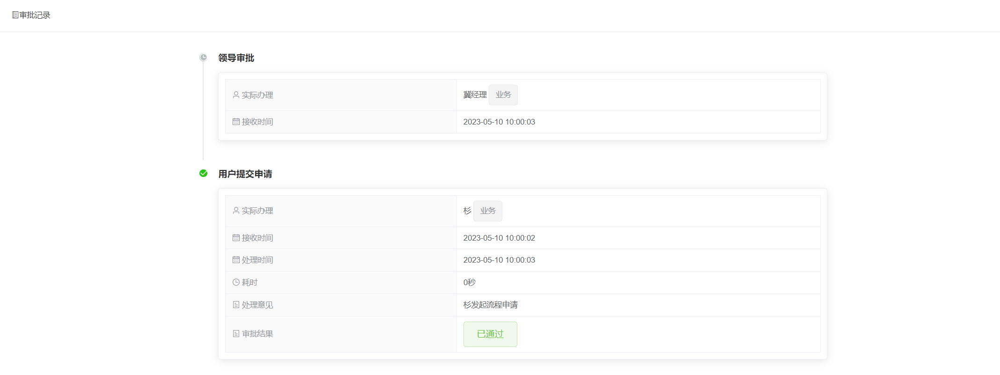

###### 审批通过操作

```http
/mt/flow/task/complete
```


当该节点配置可选审批人时，可对下一个审批人进行操作

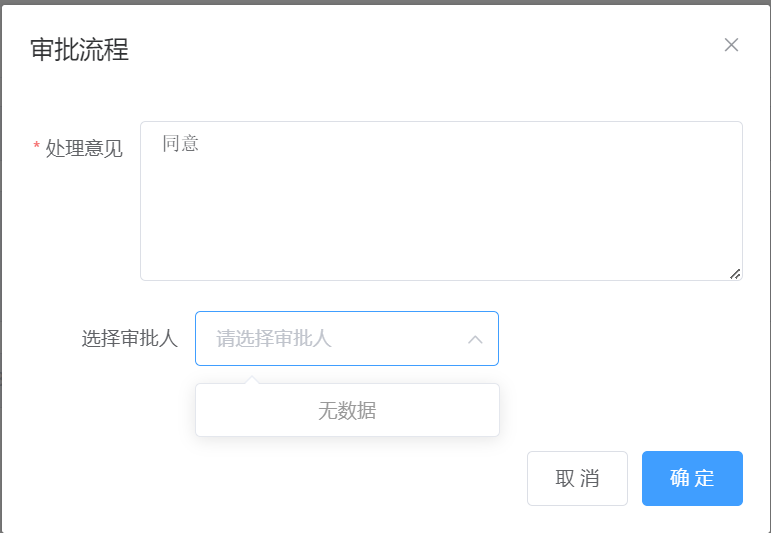

###### 审批驳回操作

```http
/mt/flow/task/stop/process
```


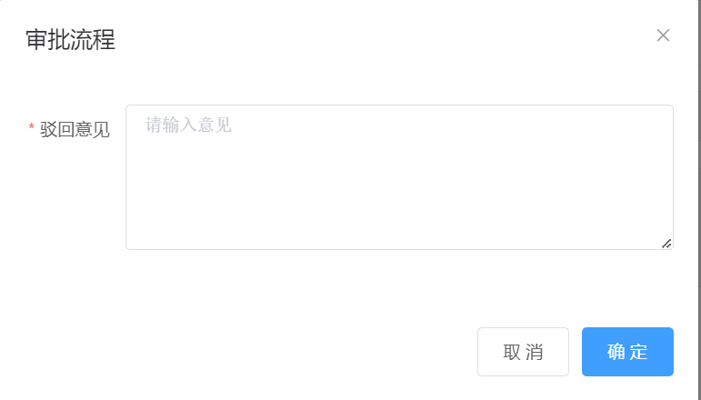


##### 查看已办任务

```http
/mt/flow/task/finishedList
```

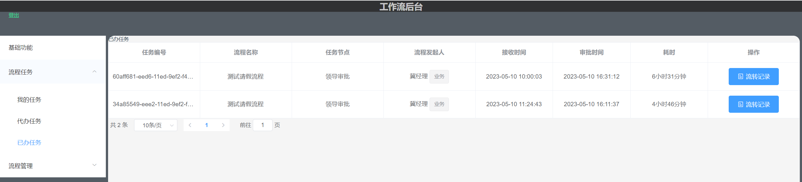


##### 节点待选审批人

```http
/mt/flow/definition/list
```

可查询到当前所有流程信息

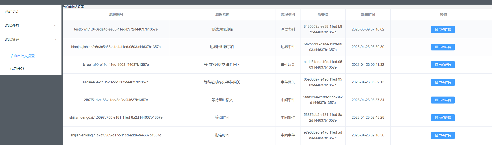

###### 配置节点候选审批人

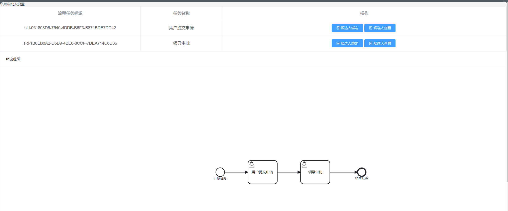


###### 节点绑定人员


###### 查看节点已绑定人员

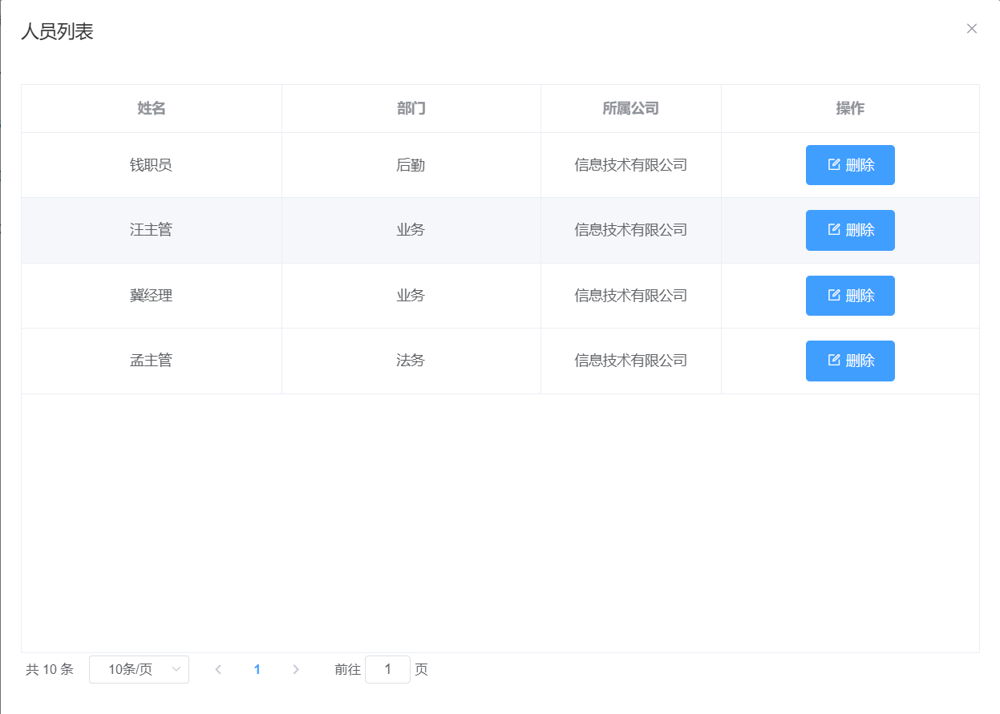

###### 审批时，可选择下一个节点审批人

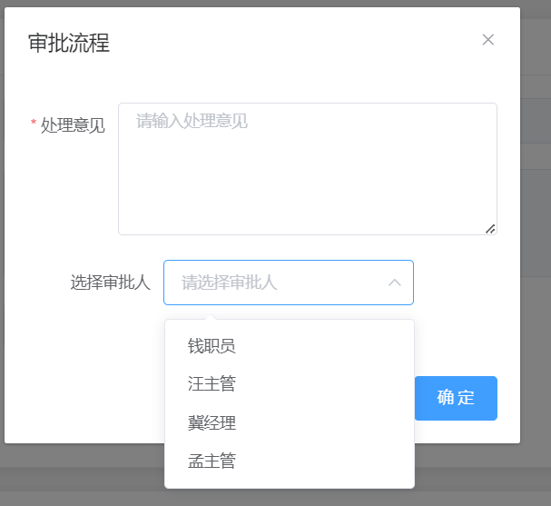


# 流程图使用用例

一下帖子仅供参考

在使用简单例子与官方简单例子里，有着流程属性值缺少导致流程无法使用的情况。目前因为初步使用，暂时不清楚问题的原因。目前暂时使用若依的flow able，熟悉一下流程。

### 简单例子

[Flowable最新版6.7.0入门篇之基于SpringBoot的例子 - 掘金 (juejin.cn)](https://juejin.cn/post/7029921734115459109)


### 官方简单的流程例子

[Flowable最新版6.7.0入门篇之基于JavaAPI的例子结合FlowableUI - 掘金 (juejin.cn)](https://juejin.cn/post/7028491424299483166)


若依有着较为完整的实际例子

[流程设计 · 语雀 (yuque.com)](https://www.yuque.com/u1024153/icipor/hnxue6)

[RuoYi-flowable: 基RuoYi-vue + flowable 6.7.2 的工作流管理 右上角点个 star 🌟 持续关注更新哟 技术合作联系：Almost-2y(微信) ~~~~~~~~~~~~~~~~~~~~~~~~~~~~~~~~ 农业认养商城系统：https://gitee.com/tony2y/smart-breed](https://gitee.com/tony2y/RuoYi-flowable#https://gitee.com/link?target=https%3A%2F%2Fwww.yuque.com%2Fu1024153%2Ficipor)


## 实际使用

###  RepositoryService

RepositoryService提供了管理与控制部署(deployments)与流程定义(process definitions)的操作。管理静态信息等。

流程文件的准备：

目前有官方的flowableUI与导入xxxx.bpmn20.xml 两种方式，flowable需要连接数据并且可以实时更改流程信息，xxxx.bpmn20.xml是使用离线的方式进行更改，需要二次导入至系统中

一下是两种导入xxxx.bpmn20.xml文件的方法

```java
// 将一个文件导入到数据库中
@Test
public void DeployProcess(){
    Deployment holiday = repositoryService.createDeployment()
            .addClasspathResource("测试流程图.bpmn20.xml")
            .name("测试流程部署")
            .deploy();
}


// 将一个文件流导入到数据库中
    /**
     * 导入流程文件
     *
     * @param name 流程名称
     * @param category 流程分组
     * @param in 文件流信息
     */
    @Override
    public void importFile(String name, String category, InputStream in) {
        Deployment deploy = repositoryService.createDeployment()
                .addInputStream(name + BPMN_FILE_SUFFIX, in)
                .name(name)
                .category(category)
                .deploy();
        ProcessDefinition definition = repositoryService.createProcessDefinitionQuery()
                .deploymentId(deploy.getId())
                .singleResult();
        repositoryService.setProcessDefinitionCategory(definition.getId(), category);
    }

```

## 关键参数

deploymentId 流程部署id

procInstId 流程实例Id

taskId 任务Id

taskDefinitionKey 任务定义建

executionId 执行Id

processDefinitionId 流程定义Id

processDefinitionKey 流程定义Key

processDefinitionName 流程定义名称


**流程实例ID（process instance ID）**:是指在工作流系统中创建的一个工作流实例，用于标识某个具体的工作流程实例。每次启动一个工作流程时，都会创建一个新的流程实例ID，并在该工作流实例的整个生命周期中一直存在。流程实例ID通常是唯一的且不可变的，可用于标识和跟踪工作流程实例的状态和进展情况。在Activiti中，流程实例ID以字符串形式存储，通常由36位的字母和数字组成。

**流程定义 ID（Process Definition ID）**:是一个字符串，用于唯一标识流程定义。每个部署（Deployment）都有一个或多个流程定义，每个流程定义都有一个唯一的 ID，用于标识该流程定义。可以使用流程引擎的 RepositoryService 获取流程定义的 ID

**taskDefinitionKey(任务定义键)**:是任务的定义键，它标识了特定任务在流程定义中的位置。在流程定义中，每个任务都有一个唯一的`taskDefinitionKey`，用于定义流程模型中的任务节点。`taskDefinitionKey`可以用于流程定义的创建、查询和操作。

**流程部署ID（Deployment ID）**:是在部署流程定义文件时，由Activiti生成的唯一标识符。每次部署新的流程定义文件时，都会生成一个新的Deployment ID。可以通过Deployment ID来查询该部署的流程定义信息，包括流程定义文件的名称、版本、流程定义ID等。在Activiti中，可以使用`RepositoryService`提供的方法获取流程定义的相关信息。例如，可以通过以下代码获取指定Deployment ID的流程定义信息：

**流程任务id（Task ID）**:是指当前正在执行的任务的唯一标识符，每个流程任务都有一个对应的任务id。在Activiti中，任务id是一个字符串类型的变量，可以通过任务对象的getId()方法来获取。任务id的作用是唯一标识当前任务，可以用于流程图的展示、任务的操作等。

**流程定义的 key（ProcessDefinition Key）**:` 是流程定义的唯一标识符，通常用于区分不同的流程定义。在部署流程时，需要指定 `processDefinitionKey`，这个值会在数据库中作为流程定义的 `KEY_` 存储。当启动一个流程实例时，需要指定流程定义的 `processDefinitionKey`，Activiti 引擎会根据这个值在数据库中找到相应的流程定义，并根据该流程定义创建一个流程实例。

**流程执行ID（ExecutionId ID）**:是Activiti和Flowable中表示单个执行实例的唯一标识符。每个执行实例代表流程中的一个活动实例，即当前流程实例中正在执行的一个节点，它包含该节点的状态信息和上下文数据。例如，如果当前流程实例正在执行一个用户任务，则相应的执行实例包含该用户任务的信息，如任务ID，任务名称，任务办理人等。执行ID是在流程实例启动时自动生成的，可用于在流程中唯一地标识一个执行实例。通过执行ID，可以访问执行实例的各种信息和操作，如查询当前执行节点，获取和设置执行实例的变量值，终止执行等。


[相关文档链接](https://www.jianshu.com/p/d71fe8fbeae4)


## 主要表内容

| ACT_RU_TASK | 用户任务表--TaskEntityImpl |
| ----------- | -------------------------- |
|             |                            |

| ACT_RE_PROCDEF | 流程定义信息表--ProcessDefinitionEntityImpl |
| -------------- | ------------------------------------------- |
|                |                                             |

| ACT_RE_DEPLOYMENT | 流程部署表--DeploymentEntityImpl |
| ----------------- | -------------------------------- |
|                   |                                  |

[(51条消息) flowable 数据库表结构_javafanwk的博客-CSDN博客_flowable 表](https://blog.csdn.net/fwk19840301/article/details/100013577)

### act_re_deployment

该表用于存储 Flowable 引擎中的流程部署相关信息。以下是对表结构中各个字段的解释：

- `ID_`：流程部署的唯一标识符，是主键字段。
- `NAME_`：流程部署的名称，用于标识不同的流程部署。
- `CATEGORY_`：流程部署的分类，可以用于对流程进行分组或归类。
- `KEY_`：流程部署的关键字，通常用于在引擎中唯一标识流程部署。
- `TENANT_ID_`：租户标识符，用于多租户场景下对流程进行隔离。
- `DEPLOY_TIME_`：流程部署的时间戳，记录了流程部署的时间。
- `DERIVED_FROM_`：派生自其他流程部署的 ID。
- `DERIVED_FROM_ROOT_`：派生自根流程部署的 ID。
- `PARENT_DEPLOYMENT_ID_`：父流程部署的 ID。
- `ENGINE_VERSION_`：Flowable 引擎的版本号。

这些信息可以通过该表进行查询和管理，用于支持流程定义的部署和管理功能。


## 主要官方接口

### `RepositoryService` 

`RepositoryService` 是 Flowable 框架提供的一个服务接口，用于管理流程定义和流程部署。它提供了一系列方法，用于创建、查询、更新和删除流程定义以及与流程资源的交互。

以下是 `RepositoryService` 接口的一些主要方法和功能：

1. 流程定义管理：
   - `createDeployment()`：创建一个新的流程部署，并返回 `DeploymentBuilder` 对象，用于构建和添加流程资源。
   - `deploy()`：将流程部署到 Flowable 引擎中，使其可用于流程实例的启动和执行。
   - `deleteDeployment()`：删除指定的流程部署，可选择是否级联删除相关的流程实例、任务和历史数据。
   - `createProcessDefinitionQuery()`：创建一个流程定义查询对象，用于根据各种条件查询和过滤流程定义。
2. 流程资源管理：
   - `getResourceAsStream()`：获取指定流程部署中的资源文件的输入流，如流程图定义文件、表单文件等。
   - `getProcessDiagram()`：获取流程定义的流程图的输入流，用于显示和展示流程定义的可视化图形。
   - `getProcessModel()`：获取流程定义的 BPMN 模型对象，可以用于进一步的操作和分析。
3. 其他功能：
   - `addCandidateStarterUser()`：为指定的流程定义添加候选启动用户，他们将有权限启动该流程。
   - `addCandidateStarterGroup()`：为指定的流程定义添加候选启动用户组，用户组中的用户将有权限启动该流程。
   - `suspendProcessDefinitionById()`：暂停指定 ID 的流程定义，暂停后的流程定义将无法启动新的流程实例。
   - `activateProcessDefinitionById()`：激活指定 ID 的暂停流程定义，激活后可以继续启动新的流程实例。

通过 `RepositoryService` 接口，开发人员可以方便地管理流程定义和流程部署，包括创建、查询、更新和删除流程定义，以及获取流程资源和配置等信息。它是 Flowable 框架中与流程定义和部署相关的核心服务之一。


### IdentityService

管理和操作用户身份和权限相关的功能。提供了一系列方法来管理用户、用户组和用户权限。

`IdentityService`接口定义了以下常用方法：

- `createUser(String userId)`: 创建一个新的用户。
- `deleteUser(String userId)`: 删除指定的用户。
- `createGroup(String groupId)`: 创建一个新的用户组。
- `deleteGroup(String groupId)`: 删除指定的用户组。
- `createMembership(String userId, String groupId)`: 创建用户与用户组之间的关联关系。
- `deleteMembership(String userId, String groupId)`: 删除用户与用户组之间的关联关系。
- `setUserInfo(String userId, String key, String value)`: 设置用户的自定义信息。
- `setAuthenticatedUserId(String userId)`: 用户进行身份验证并被授权执行流程操作`
- `getUserInfo(String userId, String key)`: 获取用户的自定义信息。
- `createPrivilege(String name)`: 创建一个新的权限。
- `deletePrivilege(String name)`: 删除指定的权限。
- `addUserPrivilegeMapping(String userId, String privilegeName)`: 将权限分配给用户。
- `addGroupPrivilegeMapping(String groupId, String privilegeName)`: 将权限分配给用户组。
- `deleteUserPrivilegeMapping(String userId, String privilegeName)`: 从用户中移除权限。
- `deleteGroupPrivilegeMapping(String groupId, String privilegeName)`: 从用户组中移除权限。

通过使用`IdentityService`，您可以在Flowable流程引擎中管理用户、用户组和权限，为用户分配角色和权限，以控制流程执行过程中的访问和操作权限。

需要注意的是，Flowable的身份和权限管理功能是可选的，您可以选择是否在您的应用程序中使用它，具体取决于您的需求和使用情况。

### RuntimeService

用于管理和操作流程运行时实例的服务接口。它提供了一系列方法用于创建、启动、挂起、恢复、删除流程实例，以及查询运行时数据等操作。下面是一些常用的接口方法：

1. `startProcessInstanceByKey(String processDefinitionKey)`：通过流程定义的键启动流程实例。
2. `startProcessInstanceById(String processDefinitionId)`：通过流程定义的ID启动流程实例。
3. `startProcessInstanceByKey(String processDefinitionKey, String businessKey)`：通过流程定义的键和业务键启动流程实例。
4. `startProcessInstanceById(String processDefinitionId, String businessKey)`：通过流程定义的ID和业务键启动流程实例。
5. `suspendProcessInstanceById(String processInstanceId)`：挂起指定ID的流程实例，暂停流程实例的执行。
6. `activateProcessInstanceById(String processInstanceId)`：激活指定ID的挂起流程实例，恢复流程实例的执行。
7. `deleteProcessInstance(String processInstanceId, String deleteReason)`：根据流程实例ID删除流程实例，并指定删除原因。
8. `setVariable(String executionId, String variableName, Object value)`：设置流程实例或执行的变量值。
9. `getVariables(String executionId)`：获取指定执行ID的流程实例或执行的所有变量。
10. `getVariable(String executionId, String variableName)`：根据执行ID和变量名获取流程实例或执行的指定变量值。
11. `getActiveActivityIds(String executionId)`：获取指定执行ID的流程实例的活动节点ID列表。
12. `getProcessInstance(String processInstanceId)`：根据流程实例ID获取流程实例对象。

除了上述方法之外，`RuntimeService`还提供了其他一些用于管理和操作流程实例的方法，例如查询任务、流程实例的执行、发送信号等。通过这些接口方法，可以对流程实例进行创建、管理和操作，以实现流程的控制和执行。

#### 问题

当流程结束时，`runtimeService.createProcessInstanceQuery().processInstanceId(processInstanceId).singleResult()`方法将无法查询到信息。这是因为流程实例在结束后会被删除，不再存在于运行时数据库中。

如果你需要查询已结束的流程实例的信息，可以使用`historyService`提供的相应方法。`HistoryService`用于查询和管理历史数据，包括已完成的流程实例、任务、变量等，一下是一个实例：

```java
@Resource
protected HistoryService historyService;


HistoricProcessInstance historicProcessInstance = historyService.createHistoricProcessInstanceQuery()
        .processInstanceId(processInstanceId)
        .singleResult();


if (historicProcessInstance != null) {
    // 可以访问已结束流程实例的信息
    String processDefinitionId = historicProcessInstance.getProcessDefinitionId();
    String businessKey = historicProcessInstance.getBusinessKey();
    // 其他属性和方法
} else {
    // 流程实例已结束，无法查询到信息
}
```


### HistoryService

提供了一系列方法用于查询和管理历史数据。下面是一些常用的接口方法：

1. `createHistoricProcessInstanceQuery()`：创建查询已完成的流程实例的查询对象，可以设置查询条件，并通过方法链调用进一步细化查询。
2. `createHistoricTaskInstanceQuery()`：创建查询已完成的任务的查询对象，可以设置查询条件，并通过方法链调用进一步细化查询。
3. `createHistoricVariableInstanceQuery()`：创建查询历史变量的查询对象，可以设置查询条件，并通过方法链调用进一步细化查询。
4. `createHistoricActivityInstanceQuery()`：创建查询历史活动实例的查询对象，可以设置查询条件，并通过方法链调用进一步细化查询。
5. `createHistoricDetailQuery()`：创建查询历史详情的查询对象，可以设置查询条件，并通过方法链调用进一步细化查询。
6. `createHistoricIdentityLinkLogQuery()`：创建查询历史身份链接日志的查询对象，可以设置查询条件，并通过方法链调用进一步细化查询。
7. `createHistoricTaskLogEntryQuery()`：创建查询历史任务日志的查询对象，可以设置查询条件，并通过方法链调用进一步细化查询。
8. `createHistoricFormPropertyQuery()`：创建查询历史表单属性的查询对象，可以设置查询条件，并通过方法链调用进一步细化查询。
9. `createHistoricDetailQuery()`：创建查询历史详情的查询对象，可以设置查询条件，并通过方法链调用进一步细化查询。
10. `getHistoricProcessInstance(String processInstanceId)`：根据流程实例ID获取已完成的流程实例对象。
11. `getHistoricTaskInstance(String taskId)`：根据任务ID获取已完成的任务对象。
12. `getHistoricVariableInstance(String variableInstanceId)`：根据变量实例ID获取历史变量对象。

除了上述方法之外，`HistoryService`还提供了其他一些用于查询和管理历史数据的方法。通过这些接口方法，可以对历史数据进行灵活的查询和分析，获取流程执行的详细历史信息。


# 应用举例

https://cloud.tencent.com/developer/article/1979801

## 任务驳回与回退

[flowable 中级 - 3. 节点回退、驳回 - 掘金 (juejin.cn)](https://juejin.cn/post/7171426273946763277)

[(112条消息) Flowable并行网关跳转_flowable 跳转条件_分享牛的博客-CSDN博客](https://blog.csdn.net/qq_30739519/article/details/123073810)

目前集成两种驳回方式：

 1. 用户驳回：用户主动取消本次的流程的申请，流程立即终止。

    如下如，当流程走到行政主管节点时，用户主动取消了流程，此时，在行政主管位置，实际操作人为申请的用户，而意见与结果表示是用户取消了操作。

    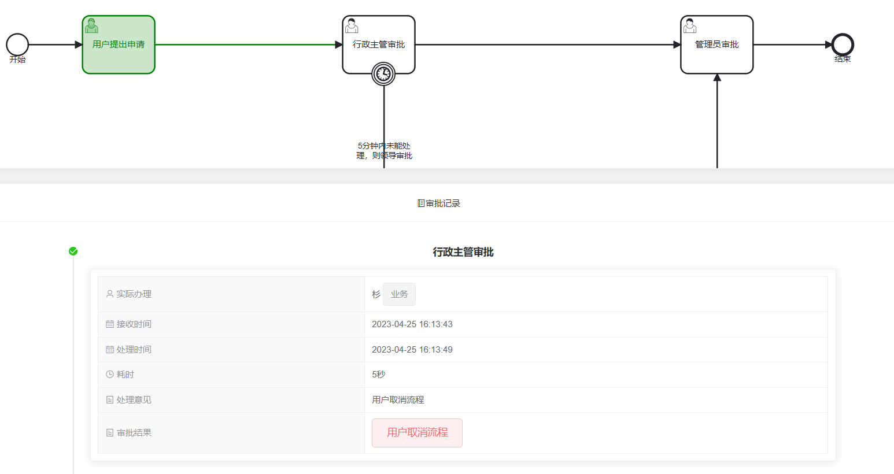

 2. 审批人驳回：审批人认为本次流程不合理，将流程直接驳回给用户，本次流程终止。

    如下图所示，用户行政主管驳回了流程，流程直接终止。

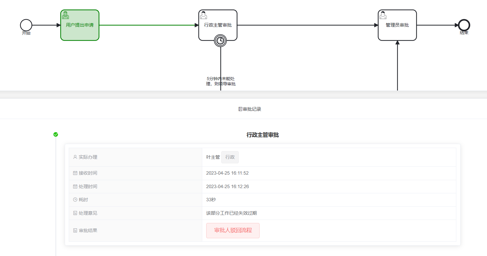

## 并行网关

并行网关
并行网关允许将流程拆分为多个分支，也可以将多个分支汇集到一起。并行网关的功能是基于流入流出的顺序流。

fork分支：用于任务的开始。并行后所有外出的顺序流，为每个顺序流都创建一个并发分支。
join汇聚：用于任务的汇聚。所有道道并行网关，在此处等待的进入分支，直到所有进入顺序流的分支都达到后，流程会通过汇集网关。
注意：如果同一个并行网关有多个进入和外出顺序流，他就同时具有分支和汇聚的功能。此时网关会线汇聚所有进入的顺序流，然后再切分为多个并行分支。
区别：并行网关并不会解析条件。即使顺序流中定义了条件，也会被忽略。


进入并行网关时，将同时开展三条审批流程线路

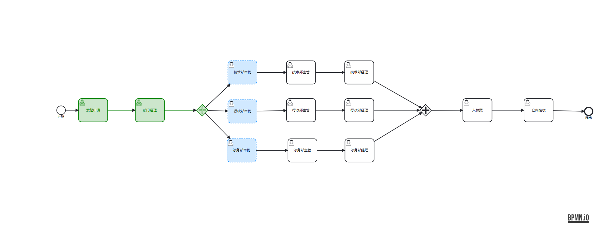


当一个节点审批结束时，需要等待其他节点审批结束，才能进行下一步审核操作

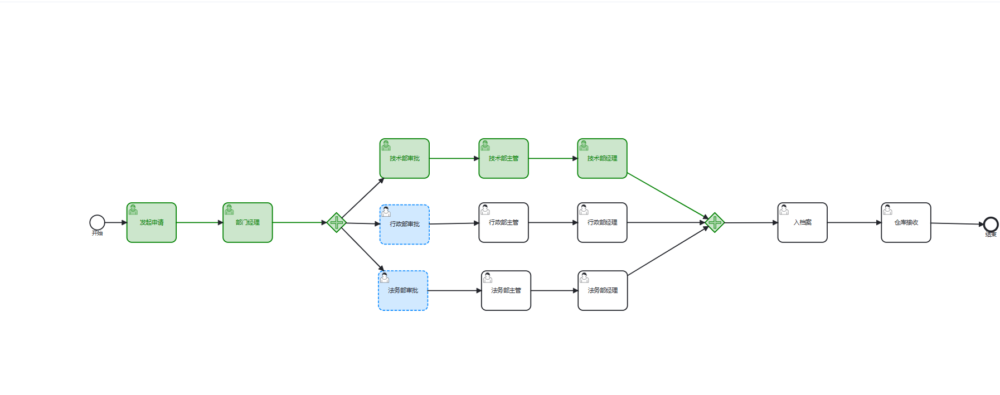

当所有并行任务完成的时候，可一进行下一步操作

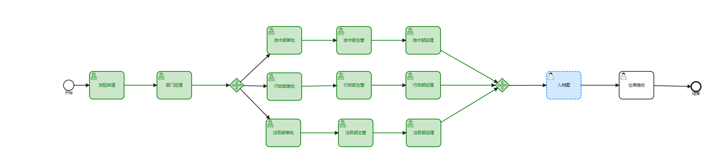

完成所有节点后任务结束

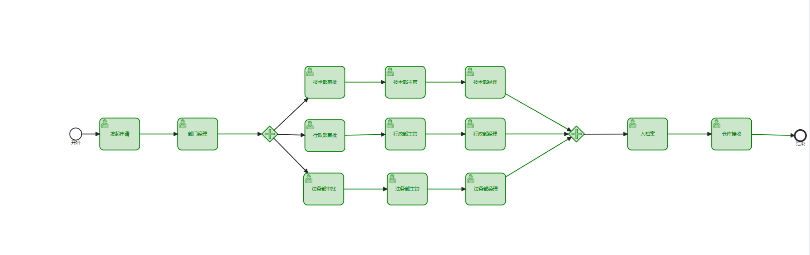

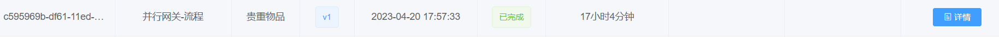

## 并行网关+服务任务

[(111条消息) Flowable 服务任务执行的三种方式__江南一点雨的博客-CSDN博客](https://blog.csdn.net/u012702547/article/details/127513360)

在并行网关中设置服务任务，使其到达该节点时。调用指定的服务方法.

又下图所示，当进入并行网关时，触发了一个用户任务与两个服务任务，当到达当前位置时，服务任务已经执行。

### 设计

在服务任务中的“类”输入框中，输入触发器类名。

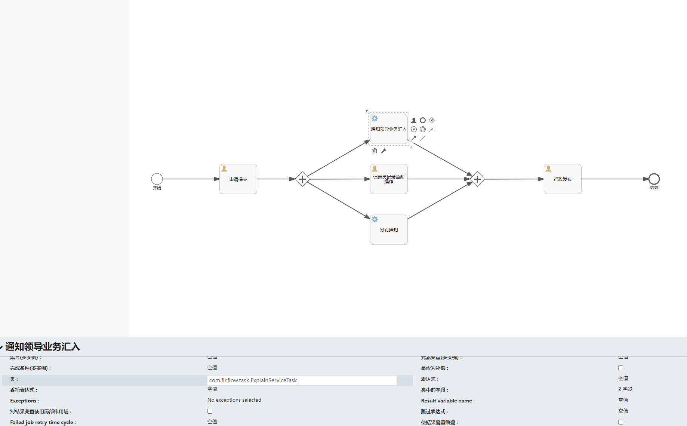

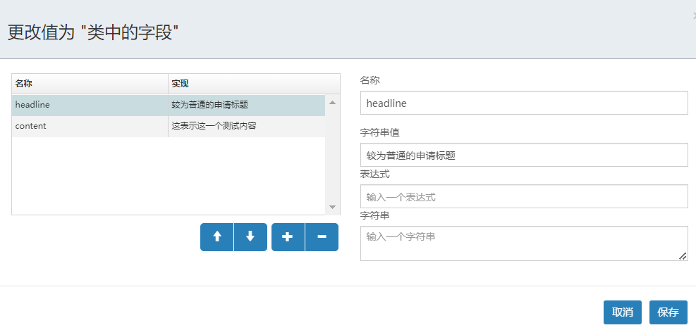

其对应的java方法如下所述：

```java

import org.flowable.common.engine.api.delegate.Expression;
import org.flowable.engine.delegate.DelegateExecution;
import org.flowable.engine.delegate.JavaDelegate;
import org.springframework.stereotype.Component;


/**
 * flowable 服务任务 监听任务模块
 *
 */
@Component
public class ExplainServiceTask implements JavaDelegate {

    /**
     * 服务任务-类中字段
     */
    Expression headline;

    Expression content;


    @Override
    public void execute(DelegateExecution execution) {
        System.out.println("username.getExpressionText() = " + headline.getExpressionText());
        System.out.println("username.getValue(execution) = " + headline.getValue(execution));
        System.out.println("username.getExpressionText() = " + content.getExpressionText());
        System.out.println("username.getValue(execution) = " + content.getValue(execution));
        System.out.println("========MyServiceTask==========");
    }
}
```


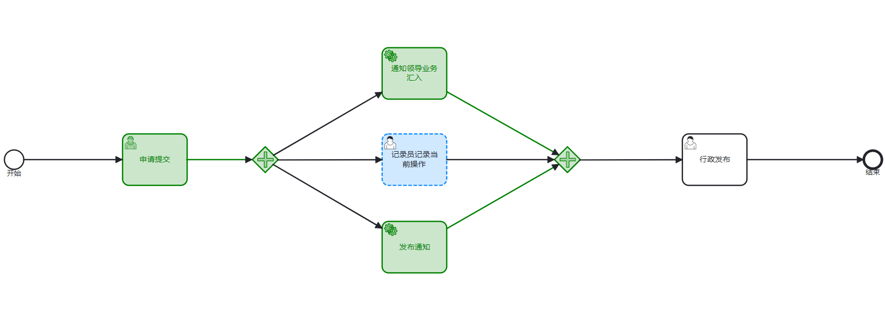

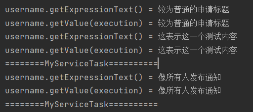


## 排他网关

设置排他网关后，进行对请假天数的判断，

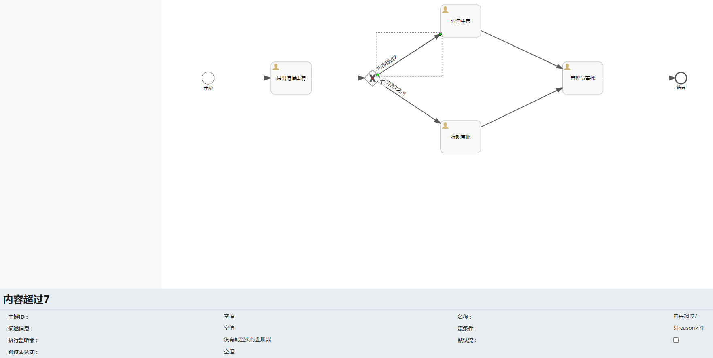

当在实际应用的时候如下图所属


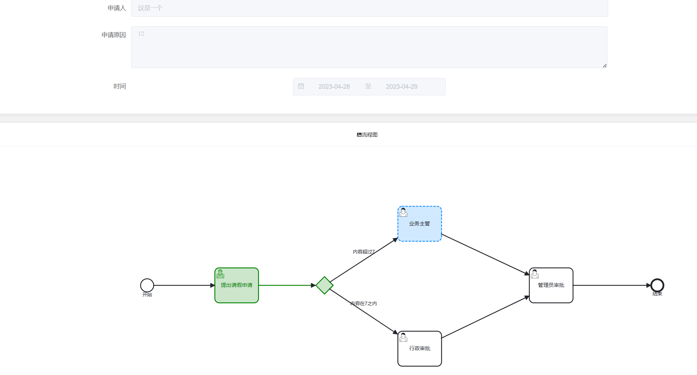

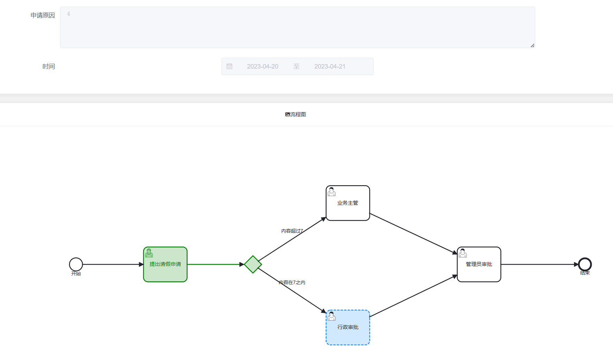


最后，可以通过其中的一个完成整个任务


## 包容网关

[(112条消息) Flowable进阶学习（六）网关（排他网关、并行网关、包容网关、事件网关）_flowable 包容网关_Huathy-雨落江南，浮生若梦的博客-CSDN博客](https://blog.csdn.net/qq_40366738/article/details/128756938)
包容网关可以看作是排他网关与并行网关的结合。并行网关也会像排他网关一样，解析定义条件。但区别是包含网关可以选择多条顺序流，这与并行网关是一样的。

分支：所有外出顺序流的条件都会被解析，结果为true的顺序流会以并行的方式继续执行，会为每个顺序流创建一个分支。
汇聚：所有并行分支达到包含网关，会进入等待状态，直到每个包含流程token的进入顺序流的分支都到达。即包含网关只等待被选中执行了的进入顺序流。这也是与并行网关的区别。


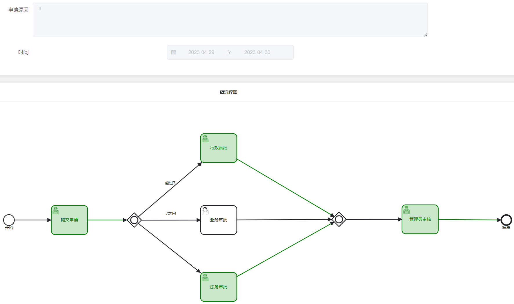


## 事件网关

https://cloud.tencent.com/developer/article/1979803


## 边界事件

### 边界计时器事件

实现当**行政主管**在接受的5分钟内没有完成任务时，该任务由**行政经理**代为完成。

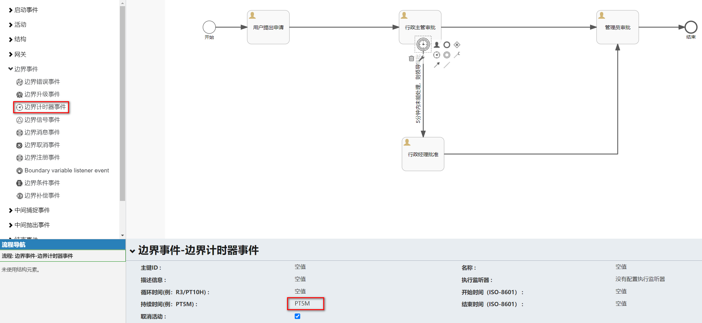

情况一：主管完成任务，行政经理并无需操作，也不会接收到任务通知。

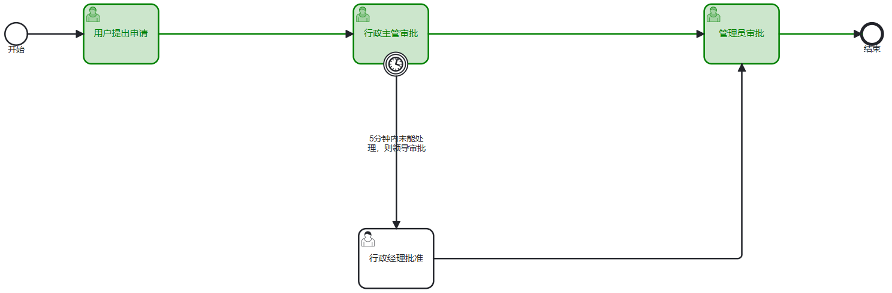

情况二：行政经理会接收到通知，此时由行政主管完成。行政经理无法完成，且无该流程的代办任务。

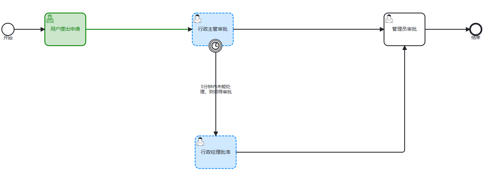

## 中间事件

[flowable-流程中心设计之中间事件(六) - 意犹未尽 - 博客园 (cnblogs.com)](https://www.cnblogs.com/LQBlog/p/15821015.html)

**实现中间事件相关功能需要开启flowable的异步定时任务**

```yaml
flowable:
  # 关闭异步定时任务：如果要是启动事件，则需要开启该配置
  async-executor-activate: true
```


### 中间计时器捕获事件

#### 持续时间 Timer duration

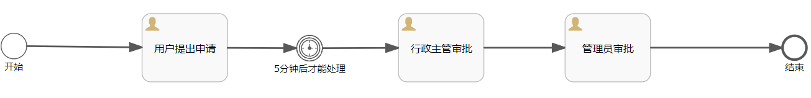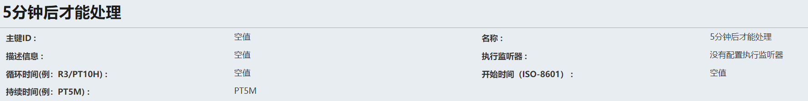


#### 开始时间 **timeDate**

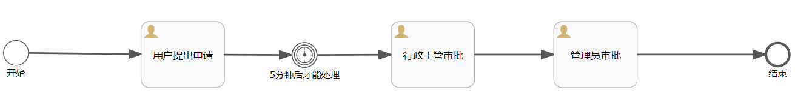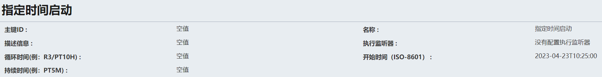


# 模型设置错误

## 案例1：中间计时器捕获事件与边界计时器事件

原设计思路：审批超时时，由其他的人进行审批，完成本次流程。

错误原因，如以下错误的模型，计时器用的是中间捕获计时器事件（这是错误的），应该用[边界计时器事件](#边界计时器事件)

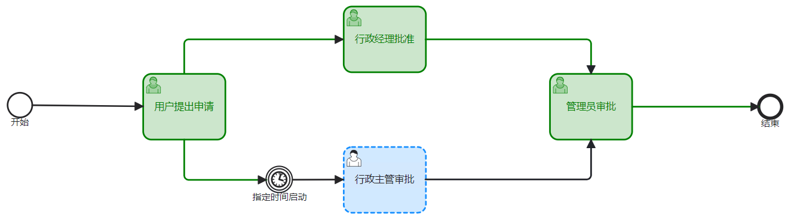

## 案例2

```java
org.flowable.common.engine.api.FlowableException: Errors while parsing:
[Validation set: 'flowable-executable-process' | Problem: 'flowable-event-gateway-only-connected-to-intermediate-events'] : Event based gateway can only be connected to elements of type intermediateCatchEvent - [Extra info : processDefinitionId = shijian-dengdaichaoshiyijiao | processDefinitionName = 事件网关-等待超时移交审批 |  | id = sid-B986E704-F3A4-4B89-928A-532071B33EC9 | ] ( line: 34, column: 70)

```


事件网关必须连接事件元素否则导入时会解析失败

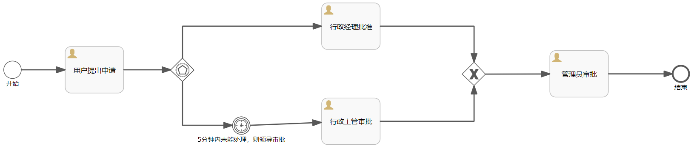

## 案例3：边界事件与中间事件（边界计时器事件与中间计时器捕获事件）

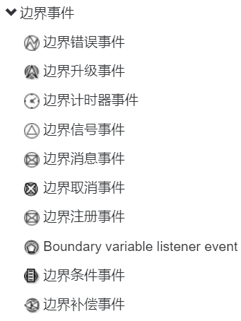

# 应用报错集锦

## no diagram to display

代码行

```javascript
if (!diagramsToImport) {
  throw new Error(translate('no diagram to display'));
}
```

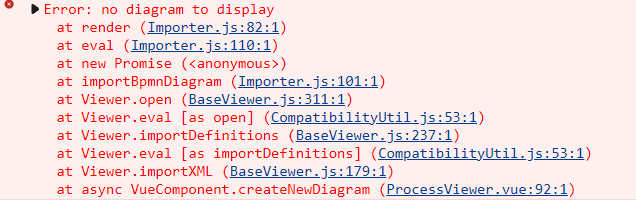

原因：

模型设计时，模型key中存在中文

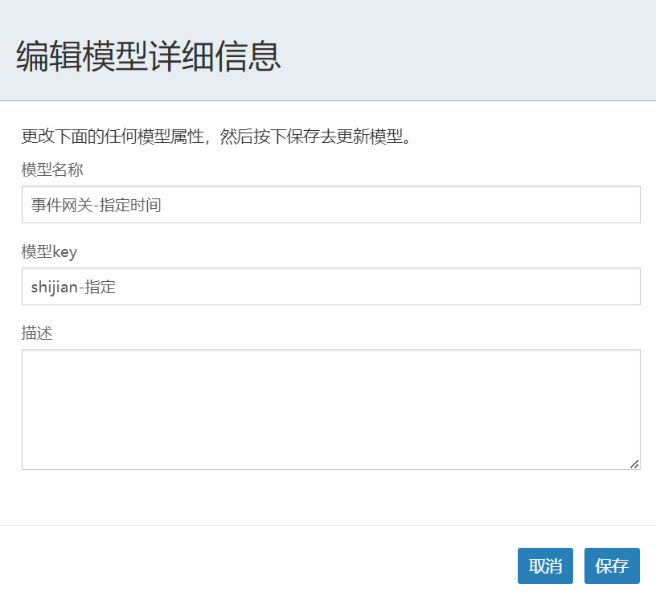

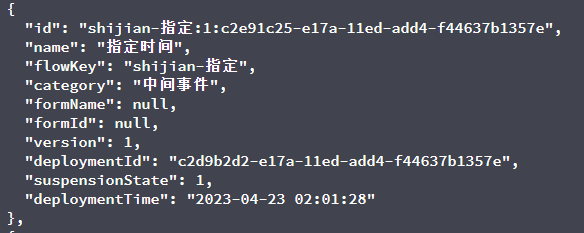


## 定时器等组件不执行

需要开启flowable的异步定时任务

```yaml
flowable:
  # 关闭异步定时任务：如果要是启动事件，则需要开启该配置
  async-executor-activate: true
```

## processInstanceId查询出多个Task

使用流程实例id查询当前节点task时，如果出现多个待审批的节点，此时会出现如下错误

```bash
org.flowable.common.engine.api.FlowableException: Query return XX results instead of max 1
```


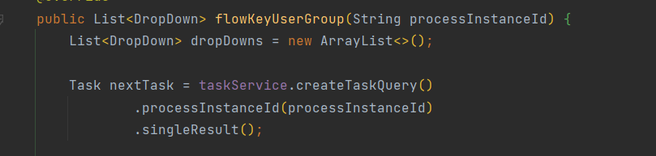

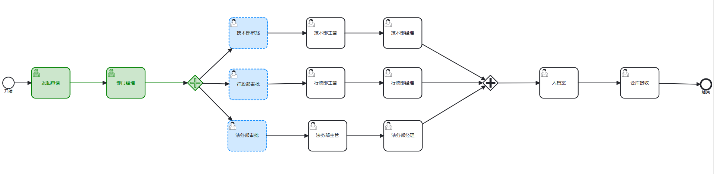


# 待优化问题：

## 边界事件触发时，将一直保持蓝色正在审批状态

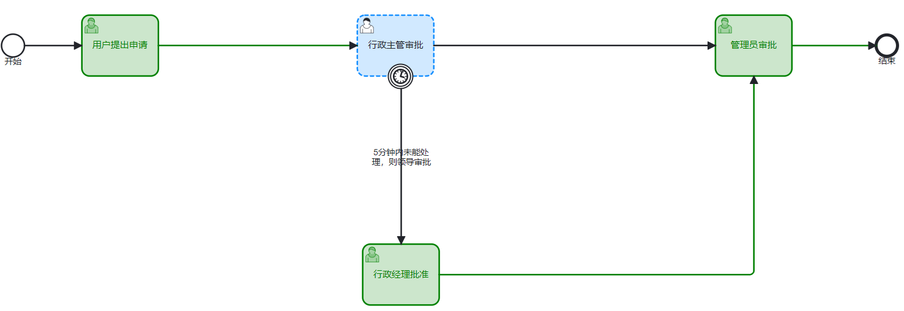


## 现前端鼠标指针二级显示，收到区域影响显示遮挡

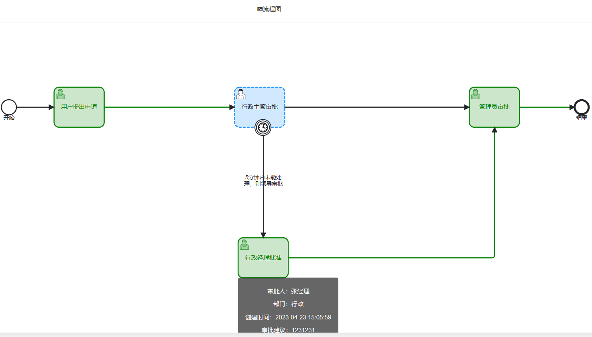


