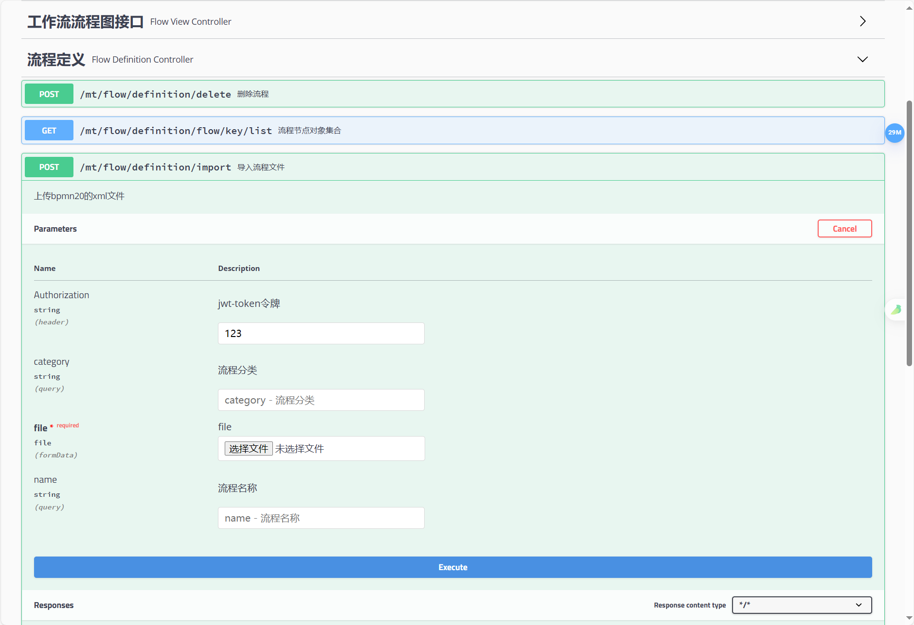
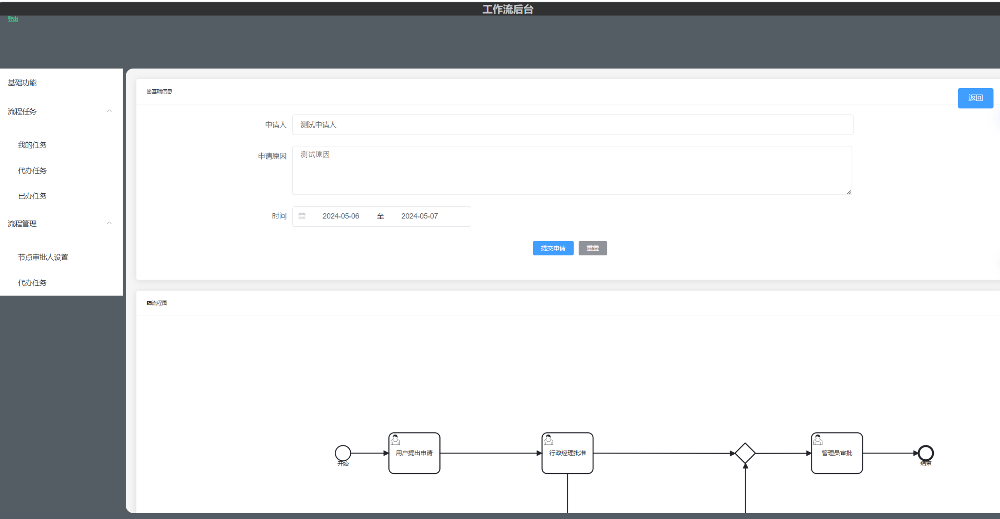
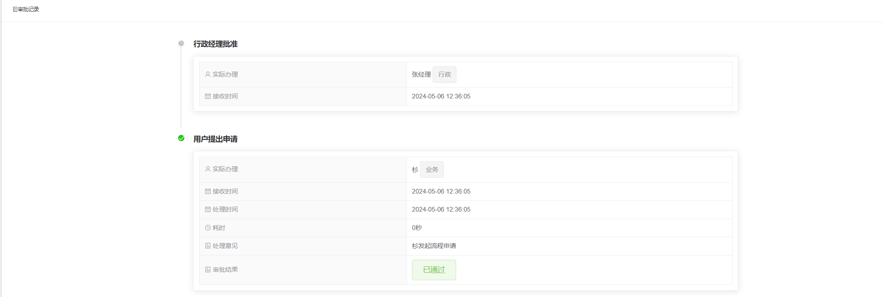
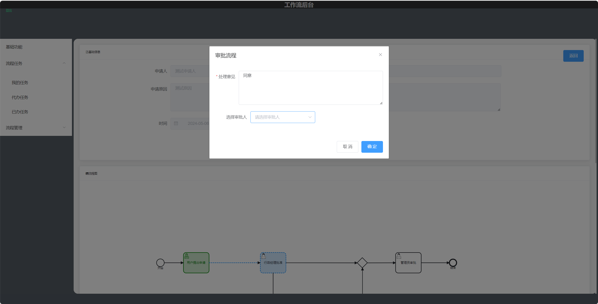
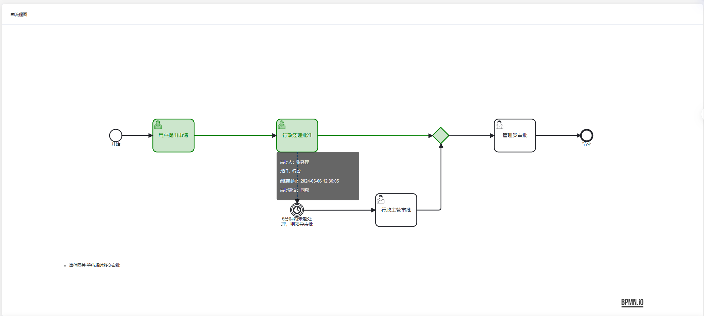

本项目只单独集成工作流，便于集成到现有项目中。

（前端水平有限，尽情谅解。）

本项目借鉴芋道与若依实现(2022年8月版本

[toc]

# 设计工具

## 流程图设计

建议使用官方的flowable-UI，官方编辑器界面

本项目中的**java_fir_flowable_ui**以集成，建议与实际项目分开，不然就会直接影响实际项目的审批流程。

设计完之后导入项目

# 流程发起与审批

## 发起流程

## 实时审批记录

##  指定用户审批

## 节点弹窗

